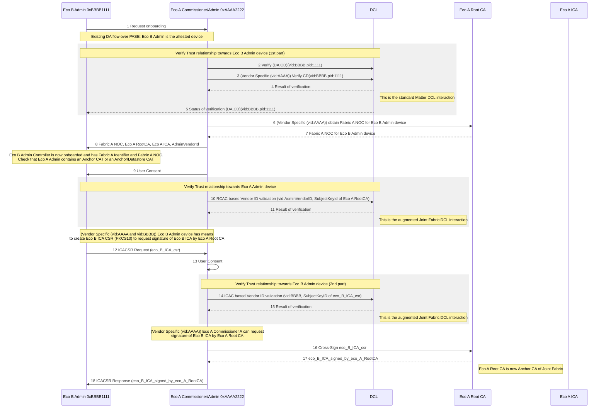

Matter Specification R1.4 Connectivity Standards Alliance Document 23-27349 November 4,


# Chapter 12. Multiple Fabrics

## 12.1. Introduction

The Multiple Fabric feature allows a Node to be commissioned to multiple separately-administered Fabrics. With this feature a current Administrator can (with user consent) allow the Commissioner for another fabric to commission that Node within its Fabric. The new Commissioner MUST have their own Node Operational Certificate (NOC) issued by its Trusted Root Certificate Authority (TRCA). Once commissioning is completed and the Node is properly configured, Administrators on the newly joined Fabric have access to the Node and can perform all administrative tasks.

A Fabric is anchored by its Trusted Root Certificate Authority (TRCA). A TRCA MAY delegate to one or more Intermediate Certificate Authorities (ICA) which issue NOCs. Multiple vendors or companies can use the same CA hierarchy in which case they will be governed under the same Trusted Root Certificate Authority.

## 12.2. Joint Fabric

### 12.2.1. Introduction

When multiple vendors or companies use the same CA hierarchy, governed under the same Trusted Root Certificate Authority, they create a Joint Fabric using the Joint Commissioning Method flow. This flow enables a set of one or more companies to use a single fabric anchored by the Trusted Root Certificate Authority (TRCA). In the context of JCM, the fabric that is anchored by this TRCA is known as the Anchor Fabric.

> **NOTE** Support for Joint Fabric is provisional.

### 12.2.2. Node ID Generation

Any newly-allocated Node ID SHALL:

*   be greater than 0x0000_0000_0000_0000, but less than 0xFFFF_FFEF_FFFF_FFFF, representing a value within the Operational NodeID range (see Table 4, "Node Identifier Allocations");
*   be checked to ensure its uniqueness in the NodeList attribute of the Joint Fabric Datastore

The Node ID SHALL be regenerated if these constraints are not met.

It is RECOMMENDED to use random allocation within the valid range to avoid having to regenerate the Node ID.

### 12.2.3. Anchor ICAC requirements

Anchor ICAC SHALL be the ICAC corresponding to the Anchor Administrator. Anchor ICAC SHALL contain the reserved org-unit-name attribute from the Table 64, "Standard DN Object Identifiers" with value `jf-anchor-icac` in its Subject DN. The Anchor CA SHALL NOT place the reserved org-unit-name attribute `jf-anchor-icac` value into any Node that is not the Anchor Administrator. The


Copyright © Connectivity Standards Alliance, Inc. All rights reserved. Page 1057

Matter Specification R1.4 Connectivity Standards Alliance Document 23-27349 November 4,


Anchor CA SHALL place the reserved `org_unit-name` attribute `jf-anchor-icac` value into the Anchor ICAC.

### 12.2.4. Joint Fabric ACL Architecture

A set of CASE Authenticated Tags defined to be used in the context of Joint Fabric. In combination with the Anchor ICAC, these CATs can provide a greater level of security.

#### 12.2.4.1. Administrator CAT

The Administrator CAT is meant to simplify management of the group of Administrator Nodes as opposed to managing a list of subject Node IDs. All devices participating in Joint Fabric SHALL contain an ACL entry granting Administer privilege to CaseSubjectAdmin set to the Administrator CAT. During commissioning of any Node onto the Joint Fabric the CaseAdminSubject field SHALL be set to the Administrator CAT upon invoking the AddNOC command.

Any Node advertising as a Joint Fabric Administrator SHALL contain the Administrator CAT in its NOC. A NOC containing the Administrator CAT MAY be issued by any Joint Fabric Administrator.

Any client that discovers the Administrator Node with DNS-SD and connects to the Node via CASE SHALL check if the Administrator CAT is present in the NOC of the Node as part of the CASE handshake. This SHALL be required in order to verify that the Node is authorized to act as an Administrator in the Joint Fabric.

If the Administrator CAT is already in use in a fabric that wants to participate in the Joint Fabric then its Administrator first needs to take the required steps for updating it with a non-overlapping Administrator CAT. This may involve updating ACLs and NOCs on the Nodes wishing to participate in the Joint Fabric.

Concern for its use in gaining unauthorized Administer access is mitigated by the fact that the Administrator CAT is a special subject distinguished name within the NOC and that the NOC must be issued by an Administrator and not self-issued.

User initiated and granted revocation of an Administrator to administer nodes SHALL be achieved by updating the Administrator CAT. The Joint Fabric Anchor Administrator SHALL increment the version number of the Administrator CAT to a value higher than its current value (e.g., from 0x0000 to 0x0001), update the existing credentials (NOC) for all Administrator Nodes that are NOT being revoked with the new version of the Administrator CAT, and update the ACL entry of all Nodes whose subject list contains the prior version of the Administrator CAT with the new version of the Administrator CAT. This has the effect of revoking the Administer access of any Administrator Nodes that did not receive updated credentials (NOC) with the new version of the Administrator CAT. Completing this operation requires visiting all the nodes in the Joint Fabric, a task which might take a long time to complete or might never complete if some Nodes are permanently offline or otherwise unreachable. However, any Nodes that are permanently offline are probably not at risk due to the no longer trusted Administrator Node because they are inaccessible to it.

#### 12.2.4.2. Anchor CAT

Any Node advertising as a Joint Fabric Anchor SHALL contain the Anchor CAT in its NOC. A NOC containing the Anchor CAT SHALL be issued only by the Joint Fabric Anchor ICAC.


Page 1058 Copyright © Connectivity Standards Alliance, Inc. All rights reserved. csa connectivity standards alliance

Matter Specification R1.4 Connectivity Standards Alliance Document 23-27349 November 4,


Any client that discovers a Anchor Node with DNS-SD and connects to the Node via CASE SHALL check if the Anchor CAT or the Anchor/Datastore CAT is present in the NOC of the Node and the NOC chains up to the Anchor ICAC.

If the Node also has the role of a Datastore then the Anchor/Datastore CAT SHALL be used instead.

### 12.2.4.3. Datastore CAT

A NOC containing the Datastore CAT SHALL be issued by any Joint Fabric Administrator.

Any client that discovers a Datastore Node with DNS-SD and connects to the Node via CASE SHALL check if the Datastore CAT or the Anchor/Datastore CAT is present in the NOC of the NODE as part of the CASE handshake. This SHALL be required in order to verify that the Node is authorized to act as a Datastore in the Joint Fabric.

If the Node is also a Joint Fabric Anchor then the Anchor/Datastore CAT SHALL be used instead.

### 12.2.4.4. Anchor/Datastore CAT

A NOC containing the Anchor/Datastore CAT SHALL be issued only by the Anchor ICAC.

Any client that discovers an Anchor/Datastore Node with DNS-SD and connects to the Node via CASE SHALL check the Anchor/Datastore CAT is present in the NOC of the Node as part of the CASE handshake. This SHALL be required in order to verify that the Node is authorized to act as an Anchor and Datastore in the Joint Fabric.

### 12.2.5. Joint Commissioning Method (JCM)

> **NOTE**
> Support for Joint Commissioning Method is provisional.

This method SHALL be implemented for Commissioners and Administrators that support Joint Fabric. Given a pre-existing Matter fabric Fabric A managed by an Ecosystem A with its own administrator nodes and commissioner nodes, a Joint Fabric can be created with another Ecosystem B such that all devices of Ecosystem A and Ecosystem B can communicate using a single operational root of trust and devices can be added to the new joint fabric by either Ecosystem.

The joint operation ensures that ICA’s from both Fabric A and Fabric B are signed by the Anchor CA (the Root CA of the fabric selected to become the Anchor Fabric), establishing a common trust between all devices of the original Fabric A and Fabric B and all newly added devices to the “Joint Fabric”.

The Joint Fabric contains multiple ecosystems whose ICACs are cross-signed by the Anchor CA. Therefore, all ecosystems participating in the Joint Fabric SHALL use an ICAC to sign NOCs. Signing NOCs with a Root CA different than the Anchor CA is not permitted in the Joint Fabric.

The following steps describe JCM. In the figure below, Ecosystem A with Fabric A acts as the Anchor Fabric and Ecosystem B with Fabric B as joining fabric to create a Joint Fabric between the two Ecosystems.

1. Commission an Administrator from the Ecosystem B (Eco B Admin) using either ECM or BCM


csa connectivity standards alliance Copyright © Connectivity Standards Alliance, Inc. All rights reserved. Page 1059

Matter Specification R1.4 Connectivity Standards Alliance Document 23-27349 November 4,


triggered by one Commissioner device from Ecosystem A (Eco A Commissioner). When Ecosystem B Administrator advertises its presence over DNS-SD (as a result of Open Commissioning Window) it SHALL also advertise the correct JF TXT key.

2. Once ECM or BCM is over, Ecosystem B Administrator SHALL check that the NOC belonging to Ecosystem A Administrator (`responder NOC` field of the `sigma-2-tbsdata`) contains either an Anchor CAT or an Anchor/Datastore CAT.

3. User Consent must be obtained on Ecosystem B before proceeding with the next steps.

4. Ecosystem B Administrator SHALL use `ec-pub-key`, `pub-key-algo` and `ec-curve-id` of Eco A RCAC together with Ecosystem A VendorID as input parameters for RCAC based Vendor ID validation.

5. Ecosystem B Administrator SHALL check that the returned certificate is a RCAC (Basic Constraint extension SHALL be marked `critical` and have the `cA` field set to TRUE).

6. Ecosystem B Administrator requests an Administrator from Ecosystem A to sign its ICA by invoking the ICACSR Request command of the Joint Fabric PKI Cluster, as described in ICA Cross Signing.

7. Ecosystem A Administrator performs the steps in ICA Cross Signing on the request from the Ecosystem B Administrator.

8. Cross-signed ICAC is returned to Ecosystem B Administrator using ICACSR Response command.

9. Ecosystem B Administrator SHALL use following commands from Node Operational Credentials cluster to update each node in the Fabric B to join the Joint Fabric:
    * a. Update TrustedRootCertificates by using AddTrustedRootCertificate
    * b. Update Node Operational Credentials using AddNOC. Subject DN of the issued NOCs encodes a `matter-fabric-id` attribute whose value SHALL be identical with the value of the `matter-fabric-id` attribute from the cross-signed ICAC.
    * c. Remove the old Trusted Root CA Certificate and the associated fabric using the RemoveFabric command

Upon successful completion of JCM, all nodes from Fabric B will be part of the Joint Fabric anchored by the Ecosystem A.


Page 1060 Copyright © Connectivity Standards Alliance, Inc. All rights reserved. csa connectivity standards alliance

Matter Specification R1.4 Connectivity Standards Alliance Document 23-27349 November 4, 2024




*Figure 102. Joint Commissioning Steps*

### 12.2.5.1. Scope of User Consent

Before commissioning a Joint Fabric Administrator, the user SHALL be asked for consent to enable Joint Fabric functionality between ecosystems. Each ecosystem joining the Joint Fabric SHALL independently ask the user for consent.

### 12.2.5.2. Discovery

The user SHALL be able to enable JCM through an appropriate interface of the devices on that ecosystem. For example, a mobile application, a web configuration, or an on-device interface.

### 12.2.5.3. Vendor ID Validation

The Joint Fabric requires that the fabrics participating in a Joint Fabric perform mutual Vendor ID validation so that they can be sure of the authenticity of the Vendor ID being asserted. Vendor ID validation SHALL be achieved by using the VendorID Validation Procedure.

### 12.2.5.4. ICA Cross Signing

As described in the Joint Commissioning Method, an Ecosystem Administrator, different than the Joint Fabric Anchor Administrator, SHALL have the ability to issue NOCs chaining up to the Anchor CA. To obtain this ability it SHALL receive an ICAC issued by the Joint Fabric Anchor Administrator. Cross-signing means that the SubjectPublicKey of the ICAC chaining up to the Anchor CA is identical to the SubjectPublicKey of the pre-installed ICAC (chaining up to that particular Ecosystem Administrator RCAC).

The Ecosystem Administrator that needs to obtain a cross-signed ICAC SHALL create a Certificate Signing Request (ICA CSR) as described in PKCS #10:


Copyright © Connectivity Standards Alliance, Inc. All rights reserved. Page 1061

Matter Specification R1.4 Connectivity Standards Alliance Document 23-27349 November 4,


1. ICA CSR SHALL include a signature (see RFC 2986 section 4.2, SignatureAlgorithm) generated using the Private Key of its pre-installed ICAC.
2. The Public Key associated with the Private Key used to sign the ICA CSR SHALL appear in the SubjectPublicKey of the ICA CSR.
3. Minimum attributes that SHALL be present are shown in the image below. Note that the subject DN SHALL encode a `matter-fabric-id` attribute. The attribute’s value SHALL be identical to the Fabric ID of the Anchor Fabric.
4. Once the ICA CSR is created it SHALL be sent in a DER-encoded string inside the `ICACSR` parameter of the `ICACSRRequest` command.

*ICACSR*
> ```text
> Certificate Request:
>     Data:
>         Version: 1 (0x0)
>         Subject: 1.3.6.1.4.1.37244.1.5 = Fabric ID of the Anchor Fabric
>         Subject Public Key Info:
>             Public Key Algorithm: id-ecPublicKey
>             Public-Key: (256 bit)
>             pub:
>                                04:12:3b:90:f5:.......
>             ASN1 OID: prime256v1
>             NIST CURVE: P-256
>         Attributes:
>         Requested Extensions:
>     Signature Algorithm: ecdsa-with-SHA256
>             30:46:02:21:00:95:ff:......
> ```

The ICA cross signing requires a Joint Fabric Anchor Administrator to receive and validate a Certificate Signing Request by following these steps:

1. Check that User Consent has been obtained previously or ask for User Consent.
    - a. If User Consent is not obtained, error status SHALL be `IcaCsrRequestNoUserConsent`.
2. Check that the ICA CSR follows the encoding and rules from PKCS #10.
    - a. Otherwise, error status SHALL be `InvalidIcaCsrFormat`.
3. Check that the signature can be validated using the Public Key of the ICA CSR.
    - a. Otherwise, error status SHALL be `InvalidIcaCsrSignature`.
4. Convert the Subject Public Key Info of the ICA CSR’s to the equivalent Matter certificate TLV values by using the specific rules for `ec-pub-key`, `pub-key-algo` and `ec-curve-id`.
5. Perform ICAC based Vendor ID validation using as input parameters the `ec-pub-key`, `pub-key-algo`, `ec-curve-id` and the Vendor ID associated with the Administrator requesting the ICA CSR Signing:


Page 1062 Copyright © Connectivity Standards Alliance, Inc. All rights reserved. csa connectivity standards alliance

Matter Specification R1.4 Connectivity Standards Alliance Document 23-27349 November 4,


a. If the output of the validation is an empty list, error SHALL be FailedDCLVendorIdValidation
b. Check that the DCL returned certificate is an ICAC (Basic Constraints extension SHALL be marked `critical` and have the `cA` field set to FALSE).
    i. If not an ICAC, error status SHALL be NotAnIcac.
6. Upon success, ICA's certificate SHALL be signed by the RCAC of the Joint Fabric Anchor Administrator.
    a. If signing fails, error status SHALL be IcaCsrSigningFailed.
7. ICAC SHALL be returned in a PEM format inside the ICAC field of the ICACSRResponse command.

If any of the above validation checks fail, the server SHALL immediately respond to the client with an ICACSRResponse command. The StatusCode SHALL be set to the error status value specified in the above validation checks.

### 12.2.6. Anchor Administrator Selection

The Joint Fabric design allows devices to communicate with one another regardless of which commissioner was used to commission devices. Similarly, devices participating in Joint Fabric can be removed without impacting the remaining devices. If all devices commissioned using a particular commissioner are deleted, the devices remaining in the Joint Fabric will typically continue to function.

User SHALL provide consent when an Anchor Administrator is removed and a new Anchor CA is chosen. In the example below, the Anchor Administrator is removed from the Joint Fabric and the user has selected a candidate Administrator to be promoted to Anchor Administrator. For clarity, Joint Fabric Anchor Administrator A is being replaced with the candidate Joint Fabric Administrator B.

User consent SHALL be mutual:

*   on Administrator A side, User provides consent that transfer of the Anchor role to Administrator B is allowed.
*   on Administrator B side, User provides consent that receipt of the Anchor role from Administrator A is allowed.

Flow for Anchor Transfer is as follows:

1. Administrator B SHALL:
    a. send TransferAnchorRequest to Administrator A to set itself as Joint Fabric Anchor Administrator.
    b. obtain user consent prior to sending the TransferAnchorRequest command.
2. Administrator A SHALL:
    a. check that the NOC used by Administrator B during the CASE session contains an Administrator CAT.
    b. check that user provided consent that allows the transfer of the Anchor role to a different


Copyright © Connectivity Standards Alliance, Inc. All rights reserved. Page 1063

Matter Specification R1.4 Connectivity Standards Alliance Document 23-27349 November 4,


Administrator. If not, then `TransferAnchorResponse` command with `StatusCode` set to `TransferAnchorStatusNoUserConsent` SHALL be sent and the procedure stopped here.
c. check all the `Datastore` entries of type `DatastoreStatusEntry`. If any of these entries has a value that equals to `Pending` or to `DeletePending` then `TransferAnchorResponse` command with `StatusCode` set to `TransferAnchorStatusDatastoreBusy` SHALL be sent and the procedure stopped here.
d. put Joint Fabric Datastore in read only state by setting the Datastore `StatusEntry` to `DeletePending`.
e. stop DNS SD advertising of the `Administrator`, `Anchor` and `Datastore` capability inside the `JF TXT key`.
f. set `BusyAnchorTransfer` error status for the `ICACSRResponse` in case an `ICA Cross Signing` is in progress.

3. All other Joint Fabric Administrators SHALL:
    a. stop commissioning of any new devices into the Joint Fabric once it detects that Datastore `StatusEntry` equals `DeletePending`.

4. Administrator B SHALL:
    a. copy (through attribute read, BDX) Joint Fabric Datastore from Administrator A.
    b. set the Datastore `StatusEntry` to `Committed`.
    c. set the value of the Datastore `AnchorNodeId` attribute to the value of its Node ID.
    d. increase `Administrator CAT` version.
    e. use following commands from `Node Operational Credentials cluster` on the other Joint Fabric Administrators:
        i. update `TrustedRootCertificates` by using `AddTrustedRootCertificate`.
        ii. update Node Operational Credentials using `AddNOC`. `NOCs` SHALL contain an updated version of the Administrator CAT.
    f. issue itself a new NOC with the updated version of the Anchor/Datastore CAT.
    g. set itself as the new Datastore provider and Anchor Administrator by advertising the `Administrator`, `Anchor` and `Datastore` capabilities inside the `JF TXT key`.
    h. send `TransferAnchorComplete` to Administrator A to announce that transition to Anchor Administrator is complete.

5. All other Joint Fabric Administrators SHALL:
    a. subscribe to the new Datastore provider (Administrator B) having discovered the new `Datastore` capability via Service Discovery of the `JF TXT key`.
    b. check that the `NOC` used by the new Datastore provider (Administrator B) during the first CASE session contains an `Anchor/Datastore CAT` and that the NOC chains up to the `Anchor ICAC`.
    c. request `ICA Cross Signing` from the new Joint Fabric Anchor Administrator discovered via Service Discovery (`Administrator` and `Anchor` flags are set in `JF TXT key`).
    d. remove devices from the fabric governed by the old `Anchor CA` using the `RemoveFabric` com-


Page 1064 Copyright © Connectivity Standards Alliance, Inc. All rights reserved. csa connectivity standards alliance

Matter Specification R1.4 Connectivity Standards Alliance Document 23-27349 November 4,


mand.
e. start commissioning devices onto the Joint Fabric using the new ICAC for NOC issuance.

### 12.2.7. Administrator Removal

Since Joint Fabric has multiple Intermediate NOC Certificate Authorities trusted by Joint Fabric Anchor CA, the following steps SHALL be taken to remove an Intermediate NOC Certificate Authority from a Joint Fabric.

The RemoveFabric section outlines a Warning that SHALL apply here for removing a Joint Fabric Administrator.

1. Joint Fabric Anchor Administrator SHALL send a RemoveFabric command to a Joint Fabric Admin that user has consented to remove.
2. Joint Fabric Administrator SHALL remove the outgoing Administrator from the Joint Fabric Datastore.
3. The outgoing Administrator SHALL remove the given Fabric and **delete all associated fabric-scoped data.**
4. Joint Fabric Anchor Administrator SHALL increase Administrator CAT version and issue itself a new NOC.
5. Administrator B SHALL set new NOC for all the Joint Fabric Administrators.

#### 12.2.7.1. Security Consideration

Matter does not currently include any method for a Trusted Root Certificate to revoke an ICAC previously issued. Thus, to ensure proper fail proof removal of a Joint Fabric Administrator from a Joint Fabric, the Anchor Administrator SHOULD trigger a transition to a new Trusted Root Certificate as described in the Anchor Administrator Selection section. In this case, the new Anchor can be run by the same ecosystem as the old Anchor but the new Trusted Root Certificate will not issue an ICAC to the Joint Fabric Administrator that is to be removed.

## 12.3. User Consent

A user who wishes to have an already commissioned Node join another Fabric (and therefore another Security Domain) provides consent by instructing an existing Administrator, which SHALL put the Node into commissioning mode by using steps outlined in Section 5.6.4, "Open Commissioning Window". Administrators SHALL provide a mechanism for the user to thus instruct them.

## 12.4. Administrator-Assisted Commissioning Method

Administrators SHALL support opening a commissioning window on a Node using the mandatory method described in Section 5.6.3, "Enhanced Commissioning Method (ECM)". All Nodes SHALL support having a commissioning window opened using the mandatory method described in Section 5.6.3, "Enhanced Commissioning Method (ECM)".

An Administrator MAY open a commissioning window on a Node using the optional method


Copyright © Connectivity Standards Alliance, Inc. All rights reserved. Page 1065

Matter Specification R1.4 Connectivity Standards Alliance Document 23-27349 November 4,


described in Section 5.6.2, “Basic Commissioning Method (BCM)”, if the Node supports the method.

## 12.5. Node Behavior

The Node SHALL host an Section 11.19, “Administrator Commissioning Cluster”. The Cluster exposes commands which enable the entry into commissioning mode for a prescribed time, and which SHALL be invoked over a CASE secure channel. See Section 11.19.8.1, “OpenCommissioningWindow Command” and Section 11.19.8.2, “OpenBasicCommissioningWindow Command”. During such a commissioning window, the Node SHALL maintain its existing configuration, such as its operational network connection and identities, and SHOULD allow normal interactions from other Nodes.

## 12.6. Fabric Synchronization

### 12.6.1. Introduction

The Fabric Synchronization feature enables commissioning of devices from one fabric to another without requiring user intervention for every device. It defines mechanisms that can be used by multiple ecosystems/controllers to communicate with one another to simplify the experience for users.

The following diagram shows how two ecosystems/controllers would communicate after a single setup sequence.

```mermaid
graph TD
    subgraph E1 [Fabric Synchronizing Administrator <br/> (Ecosystem E1)]
        A1[Aggregator]
        FA1[Fabric Administrator]
    end

    subgraph E2 [Fabric Synchronizing Administrator <br/> (Ecosystem E2)]
        A2[Aggregator]
        FA2[Fabric Administrator]
    end

    D1[Synchronized Device D1]
    D2[Synchronized Device D2]

    A1 <--> A2
    FA1 -.-> FA2
    
    FA1 --- D1
    FA1 --- D2
    
    FA2 -.-> D1
    FA2 -.-> D2

    E1_text[Direct access <br/> from E1's <br/> private.] --- FA1
    E2_text[Direct access <br/> from E2's <br/> fabric.] -.-> FA2

    subgraph Legend
        L1[Potential CASE session from E1 with E1's fabric credentials.]
        L2[Potential CASE session from E2 with E2's fabric credentials.]
    end
    
    style L1 stroke-width:2px
    style L2 stroke-dasharray: 5 5
```

Figure 103. Example of two synchronized fabrics

### 12.6.2. Terminology

A component within an ecosystem which supports Fabric Synchronization will be referred to as a **Fabric Synchronizing Administrator**. This includes the Aggregator and Fabric Administrator node(s).

A device which is being synchronized between ecosystems will be referred to as a **Synchronized Device**.


Page 1066 Copyright © Connectivity Standards Alliance, Inc. All rights reserved. csa connectivity standards alliance

Matter Specification R1.4 Connectivity Standards Alliance Document 23-27349 November 4,


### 12.6.3. Fabric Synchronization Composition

Fabric Synchronization is present when an Aggregator satisfies the FabricSynchronization condition or one or more Bridged Nodes satisfy the FabricSynchronizedNode condition. (See Device Library, Aggregator and Bridged Node.)

```mermaid
graph TD
    subgraph FSA [Fabric Synchronizing Administrator]
        direction TB
        NWFA[Node With Fabric Administrator<br/>• Aggregator client<br/>• Fabric administration<br/>• Ecosystem specific features]
        NWA[Node With Aggregator]
        
        subgraph EP_A [EP A]
            AGG[Aggregator<br/>PartsList [BN-1, ...]]
            CCC[Commissioner Control Cluster]
            dots1[...]
        end
        
        subgraph EP_BN1 [EP BN-1]
            BN[Bridged Node]
            AC[Administrator Commissioning Cluster]
            dots2[...]
            BDBI[Bridged Device Basic Information Cluster]
            EIC[Ecosystem Information Cluster]
        end
    end

    NWFA --- NWA
    NWA --- EP_A
    EP_A --- EP_BN1
    
    Note[Both Aggregator and Fabric Administrator<br/>may be on the same Node.]
    Note -.-> NWFA
    Note -.-> NWA
```

*Figure 104. Composition of a device supporting Fabric Synchronization.*

An Aggregator supporting Fabric Synchronization SHALL be composed of the following components.

#### 12.6.3.1. Matter Fabric Administrator Node

The device providing the Aggregator SHALL be able to commission nodes on its fabric.

#### 12.6.3.2. Aggregator Node

When Fabric Synchronization is supported, the Aggregator with FabricSynchronization condition (see Device Library, Aggregator) SHALL be met on an endpoint with the following endpoints in the Descriptor cluster PartsList.

**Commissioner Control Cluster**

The Commissioner Control Cluster enables another device which supports Fabric Synchronization to set up a bidirectional synchronization relationship without the user having to scan a QR code or enter a Manual Pairing Code (as used in ECM flow) for a device.

Fabric Synchronization SHALL be supported when the SupportedDeviceCategories attribute in the Commissioner Control Cluster has the FabricSynchronization bit set.

**Bridged Node Endpoint(s)**

Every Bridged Node endpoint presented that conforms to the FabricSynchronizedNode condition (see Device Library, Bridged Node) represents a device that can be synchronized (A Synchronized Device).


Copyright © Connectivity Standards Alliance, Inc. All rights reserved. Page 1067

Matter Specification R1.4 Connectivity Standards Alliance Document 23-27349 November 4,


The Bridged Node with FabricSynchronizedNode condition enables the synchronization of devices between fabrics by the following:

*   The Bridged Node SHALL include the Ecosystem Information Cluster. (Enables discovery and directory synchronization.)
*   The Bridged Node SHALL include the Administrator Commissioning Cluster when the user consents to share a device. (Enables synchronization of devices between fabrics.)
*   The Bridged Node SHOULD support the BridgedICDSupport feature in the Bridged Device Basic Information Cluster if the Synchronized Device is an Intermittently Connected Device (ICD). (Enables communication with ICDs.)

### 12.6.4. Preventing Device Duplication

A Fabric Synchronizing Administrator SHOULD NOT commission devices onto the same fabric that they are already on. To avoid this, the Fabric Synchronizing Administrator SHOULD examine the UniqueID of a potential Synchronized Device’s Bridged Device Basic Information Cluster and SHOULD examine the VendorID and ProductID fields if they are present in the Bridged Device Basic Information Cluster. If all of the provided values for UniqueID, ProductID, and VendorID match a known device that is already on the Fabric Synchronizing Administrator’s fabric, then it SHOULD NOT attempt to commission the device.

#### 12.6.4.1. Missing UniqueID

The UniqueID field in the Basic Information Cluster became mandatory after the initial release of this specification. Therefore, the following must be performed to support devices without UniqueIDs.

When a Fabric Synchronizing Administrator commissions a Synchronized Device, it SHALL persist and maintain an association with the UniqueID in the Bridged Device Basic Information Cluster exposed by another Fabric Synchronizing Administrator.

If a Fabric Synchronizing Administrator exposes a Synchronized Device which does not have a UniqueID in its Basic Information Cluster, then the Fabric Synchronizing Administrator SHALL generate and persist a new UniqueID to be used in the Bridged Device Basic Information Cluster.

#### 12.6.4.2. Unifying Generated UniqueID

When a Fabric Synchronizing Administrator establishes a PASE session to a Synchronized Device for the purposes of commissioning, the Fabric Synchronizing Administrator SHOULD verify that the device is not already present on the intended fabric as follows:

*   The Fabric Synchronizing Administrator MAY check if the UniqueID is present in the Basic Information Cluster. If the UniqueID is present, the Fabric Synchronizing Administrator can skip the below check.
*   If the UniqueID is not present or not checked, the Fabric Synchronizing Administrator SHOULD check if the intended fabric is already present in the Fabric Table.
    - If it is present, the Fabric Synchronizing Administrator SHOULD NOT complete commissioning and SHOULD avoid attempting to commission the device (or establish PASE sessions) in


Page 1068 Copyright © Connectivity Standards Alliance, Inc. All rights reserved. csa connectivity standards alliance

Matter Specification R1.4 Connectivity Standards Alliance Document 23-27349 November 4, 2024


the future by persisting the UniqueID exposed by the other Fabric Synchronizing Administrator’s Bridged Device Basic Information Cluster. (If the Fabric Synchronizing Administrator exposes the device through a Bridged Node endpoint, then the Fabric Synchronizing Administrator SHOULD expose the UniqueID through its Bridged Device Basic Information Cluster.)
* If it is not present, the Fabric Synchronizing Administrator MAY continue the commissioning process.

To avoid the potential for getting stuck in a loop of checking the device and updating UniqueIDs in the Bridged Device Basic Information Cluster, a caching and tie-breaker policy is required. If a Fabric Synchronizing Administrator updated its Bridged Device Basic Information Cluster as a result of a duplication detected when checking the Fabric Table during a PASE session, then it SHOULD perform the following:

* The Fabric Synchronizing Administrator SHOULD create a cache of prior known UniqueIDs scoped to the NodeID of the Synchronized Device. The cache SHOULD have space for at least 5 entries per NodeID.
* If a Fabric Synchronizing Administrator (hereafter denoted A) receives a UniqueID from another Fabric Synchronizing Administrator’s (hereafter denoted B) Bridged Device Basic Information Cluster that matches an entry in the cache, but is not the entry currently presented in the Bridged Device Basic Information Cluster of the client Fabric Synchronizing Administrator (A), then the Fabric Synchronizing Administrator (A) SHOULD set the UniqueID in its Bridged Device Basic Information Cluster to the value stored in the cache which is lexicographically smaller than all other entries.

### 12.6.5. Changes to device and locations of Synchronized Devices

A fabric administrator typically has information on topology or logical grouping of the Synchronized Devices, which can be of use to the user when shared with other administrators.

For example, consider a fabric with 50 lights. If the locations (such as rooms) and device naming are not present, the user would just see a list of 50 lights on their synchronized controller and would not know which of those lights would be in which location.

Typically, the user has some means (e.g. a Manufacturer-provided app) to assign names to the Synchronized Devices, or names could be assigned automatically by the administrator. Sometimes these names are written to the Basic Information Cluster on the device, while other times the administrator does not write these names to the Basic Information Cluster.

A Fabric Synchronizing Administrator SHOULD expose such names in the Ecosystem Information Cluster on the associated endpoint. A Fabric Synchronizing Administrator MAY expose such names in the Basic Information Cluster on the associated endpoint.

If a Fabric Synchronizing Administrator exposes such names in the Basic Information Cluster for a Synchronized Device, then the same associated names SHALL be exposed in the Ecosystem Information Cluster.

Similarly, the user typically has some means to assign and change the location (e.g. room/zone) names. The grouping MAY also be applied automatically by the administrator.


csa connectivity standards alliance | Copyright © Connectivity Standards Alliance, Inc. All rights reserved. | Page 1069

Matter Specification R1.4 Connectivity Standards Alliance Document 23-27349 November 4,


A Fabric Synchronizing Administrator SHOULD expose such grouping using the Ecosystem Information Cluster as described above.

Nodes that wish to be notified of a change in such a name or location SHOULD monitor changes of the Ecosystem Information Cluster.

A Fabric Synchronizing Administrator MAY make it possible (e.g. through a Manufacturer’s app) for its users to restrict whether all or some of the Ecosystem Information Cluster is exposed to the Fabric.

### 12.6.6. Changes to the set of Synchronized Devices

Matter Devices can be added to or removed from the set of Synchronized Devices through Administrator-specific means. For example, the user can use a Manufacturer-provided app to disable synchronization of specific devices. When an update to the set of synchronized Devices occurs, the Fabric Synchronizing Administrator SHALL:

*   Update the PartsList attribute on the Descriptor clusters of the Root Node Endpoint and of the endpoint which holds the Aggregator device type.
*   Update the exposed endpoints and their descriptors according to the new set of Synchronized Devices

Nodes that wish to be notified of added/removed devices SHOULD monitor changes of the PartsList attribute in the Descriptor cluster on the Root Node Endpoint and the endpoint which holds the Aggregator device type.

Allocation of endpoints for Synchronized Devices SHALL be performed as described in Dynamic Endpoint allocation.

### 12.6.7. Fabric Synchronized Relationships

Each Client ecosystem to a Fabric Synchronizing Administrator (possibly multiple unique clients per ecosystem) will use the client ecosystem’s fabric to commission the Aggregator. The client ecosystems will each have their own dedicated, isolated fabric that is separate from the fabric used by the Aggregator to interact with the Matter devices.

This relationship can be seen in the overview figure. In that figure, Ecosystem E1 can directly access all devices and the Aggregator of Ecosystem E2 from Ecosystem E1’s fabric. This is done without requiring Ecosystem E2 to have any access granted on Ecosystem E1’s fabric.

### 12.6.8. Setup flow for Fabric Synchronization

This section will cover generic setup sequences, which ecosystems MAY extend to provide the desired level of configuration options.

#### 12.6.8.1. Fabric Synchronization Mutual Authentication

As a precondition to enabling the Fabric Synchronization feature, ecosystems MAY wait until the complete bi-directional commissioning of both ecosystems has been completed before exposing any


Page 1070 Copyright © Connectivity Standards Alliance, Inc. All rights reserved. csa connectivity standards alliance

Matter Specification R1.4 Connectivity Standards Alliance Document 23-27349 November 4,


Bridged Nodes. At this point, both ecosystems have received the device attestation from the other.

### 12.6.8.2. Scope of User Consent

Before or after commissioning a Fabric Synchronizing Administrator, the user SHALL be asked for consent to enable Fabric Synchronization functionality between ecosystems. This matches the existing single-device Administrator-Assisted Commissioning consent model that requires user consent when Matter devices are shared.

Each ecosystem SHALL independently ask the user for consent. This can be done before or after commissioning the device.

Similar to the Multi-Admin flow, after the share operation has been completed, the second Admin can now perform additional sharing operations with the device and/or data according to consent the user has given the second ecosystem.

### 12.6.8.3. Starting Condition

For the purpose of demonstrating the setup process, consider two ecosystems that provide Fabric Synchronization. These may have existing Matter devices commissioned on their independent fabrics.

```mermaid
graph TD
    subgraph E1 [Fabric Synchronizing Administrator <br/> (Ecosystem E1)]
        A1[Aggregator]
        FA1[Fabric Administrator]
    end

    subgraph E2 [Fabric Synchronizing Administrator <br/> (Ecosystem E2)]
        A2[Aggregator]
        FA2[Fabric Administrator]
    end

    D1[Device D1]
    D2[Device D2]

    FA1 -- "Direct access <br/> from E1's <br/> fabric." --- D1
    FA2 -. "Direct access <br/> from E2's <br/> fabric." .- D2

    style E1 fill:#f2f2f2,stroke:#333,stroke-width:1px
    style E2 fill:#f2f2f2,stroke:#333,stroke-width:1px
    style A1 fill:#c1e1c1,stroke:#333
    style A2 fill:#c1e1c1,stroke:#333
    style FA1 fill:#f4cccc,stroke:#333
    style FA2 fill:#f4cccc,stroke:#333
    style D1 fill:#d0eef7,stroke:#333
    style D2 fill:#d0eef7,stroke:#333
```

**Legend**
*   —— Potential CASE session from E1 with E1's fabric credentials.
*   - - - Potential CASE session from E2 with E2's fabric credentials.

Figure 105. Fabric Synchronization Setup - Example Starting Condition.

### 12.6.8.4. Enabling Fabric Synchronization Between Two Ecosystems

**User Action Summary (Informational)**

To initiate the setup of Fabric Synchronization, the manufacturer-specific setup SHOULD include the following steps:

1.  Scan a QR code or enter the Manual Pairing Code of the Commissionee Fabric Synchronizing Administrator. This is similar to the current Administrator-Assisted Commissioning of Matter devices.
2.  Consent and configure relationships on both ecosystems. (The Commissionee ecosystem MAY provide a configuration step prior to providing the QR code or Manual Pairing Code.)

If full bi-directional Fabric Synchronization is enabled, the end result of the setup process will


csa connectivity standards alliance | Copyright © Connectivity Standards Alliance, Inc. All rights reserved. | Page 1071

Matter Specification R1.4 Connectivity Standards Alliance Document 23-27349 November 4,


resemble the Introductory Example.

### Initiating Discovery

The user SHALL be able to enable the administrator-assisted commissioning of an ecosystem’s Fabric Synchronization feature through an appropriate interface of the devices on that ecosystem. For example, a mobile application, a web configuration, or an on-device interface.

The Fabric Synchronizing Administrator that advertises its presence over DNS-SD will be designated the Commissionee. The Fabric Synchronizing Administrator that performs service discovery will be designated the Commissioner.

The Commissionee SHALL provide the user with Manual Pairing Code and MAY provide the user with a QR code to initiate commissioning of the Commissionee by the Commissioner.

### Discovery

The Commissionee SHALL advertise its presence over DNS-SD (see Section 5.4.2.7, “Using Existing IP-bearing Network” and Commissionable Node Discovery.)

A Commissioner MAY discover the Commissionee device and provide the user with a notification prior to additional user action.

```mermaid
graph TD
    subgraph Commissioner_Side [Commissioner]
        C_FSA[Fabric Synchronizing Administrator<br/>(Ecosystem E1)]
        C_Agg[Aggregator]
        C_FA[Fabric Administrator]
        C_D1[Device D1]
        
        C_FSA --- C_Agg
        C_Agg --- C_FA
        C_FA --- C_D1
        
        C_FA -.->|Direct access from E1's fabric.| C_D1
    end

    subgraph Commissionee_Side [Commissionee]
        CE_FSA[Fabric Synchronizing Administrator<br/>(Ecosystem E2)]
        CE_Agg[Aggregator]
        CE_FA[Fabric Administrator]
        CE_D2[Device D2]
        
        CE_FSA --- CE_Agg
        CE_Agg --- CE_FA
        CE_FA --- CE_D2
        
        CE_FA -.->|Direct access from E2's fabric.| CE_D2
    end

    CE_FSA -.->|DNS-SD Address Record| C_FA
    
    style Commissioner_Side fill:#f9f,stroke:#333,stroke-width:1px
    style Commissionee_Side fill:#f9f,stroke:#333,stroke-width:1px
```

**Legend**
- - - - DNS SD Address Record announcement (See Commissionable Node Discovery).

Figure 106. Fabric Synchronization Setup - Commissioner Relationship Established.

### Forward Commissioning

The user SHALL then be able to initiate commissioning on another administrator with the Fabric Synchronization feature using the provided QR code or manual pairing code from the Commissioner.

The Commissioner SHALL commission the Commissionee using the steps outlined in the Concurrent connection commissioning flow.

After commissioning is complete, the Commissionee Fabric Synchronizing Administrator’s Aggregator will now be accessible on the Fabric administrated by the Commissioner.


Page 1072 Copyright © Connectivity Standards Alliance, Inc. All rights reserved. csa connectivity standards alliance

Matter Specification R1.4 Connectivity Standards Alliance Document 23-27349 November 4,


```mermaid
graph TD
    subgraph Commissioner
        FSA1[Fabric Synchronizing Administrator<br/>(Ecosystem E1)]
        AGG1[Aggregator]
        FA1[Fabric Administrator]
        FSA1 --- AGG1
        AGG1 --- FA1
    end

    subgraph Commissionee
        FSA2[Fabric Synchronizing Administrator<br/>(Ecosystem E2)]
        AGG2[Aggregator]
        FA2[Fabric Administrator]
        FSA2 --- AGG2
        AGG2 --- FA2
    end

    FA1 -- "Direct access from E1's fabric." --> D1[Device D1]
    FA2 -- "Direct access from E2's fabric." --> D2[Device D2]
    
    FA1 -- "Potential CASE session from E1 with E1's fabric credentials." --> AGG2

    style Commissioner fill:#f9f9f9,stroke:#333,stroke-width:1px
    style Commissionee fill:#f9f9f9,stroke:#333,stroke-width:1px
    style FSA1 fill:#e1e1e1
    style FSA2 fill:#e1e1e1
    style AGG1 fill:#90ee90
    style AGG2 fill:#90ee90
    style FA1 fill:#f08080
    style FA2 fill:#f08080
    style D1 fill:#add8e6
    style D2 fill:#add8e6
```

**Legend**
— Potential CASE session from E1 with E1's fabric credentials.
- - - Potential CASE session from E2 with E2's fabric credentials.

Figure 107. Fabric Synchronization Setup - Forward Commissioning Complete.

### Reverse Commissioning

After the Commissioner has finished commissioning the Commissionee, the Commissioner SHOULD initiate Reverse Commissioning using the Commissioner Control Cluster.

> **NOTE**
> A Commissionee Fabric Synchronizing Administrator MAY choose to require reverse commissioning before enabling Fabric Synchronization.

```mermaid
graph TD
    subgraph Commissioner
        FSA1[Fabric Synchronizing Administrator<br/>(Ecosystem E1)]
        AGG1[Aggregator]
        FA1[Fabric Administrator]
        FSA1 --- AGG1
        AGG1 --- FA1
    end

    subgraph Commissionee
        FSA2[Fabric Synchronizing Administrator<br/>(Ecosystem E2)]
        AGG2[Aggregator]
        FA2[Fabric Administrator]
        FSA2 --- AGG2
        AGG2 --- FA2
    end

    FA1 -- "Direct access from E1's fabric." --> D1[Device D1]
    FA2 -- "Direct access from E2's fabric." --> D2[Device D2]
    
    FA1 -- "Potential CASE session from E1 with E1's fabric credentials." --> AGG2
    AGG2 -. "Potential CASE session from E2 with E2's fabric credentials." .-> FA1

    style Commissioner fill:#f9f9f9,stroke:#333,stroke-width:1px
    style Commissionee fill:#f9f9f9,stroke:#333,stroke-width:1px
    style FSA1 fill:#e1e1e1
    style FSA2 fill:#e1e1e1
    style AGG1 fill:#90ee90
    style AGG2 fill:#90ee90
    style FA1 fill:#f08080
    style FA2 fill:#f08080
    style D1 fill:#add8e6
    style D2 fill:#add8e6
```

**Legend**
— Potential CASE session from E1 with E1's fabric credentials.
- - - Potential CASE session from E2 with E2's fabric credentials.

Figure 108. Fabric Synchronization Setup - Reverse Commissioning Complete.

### Fabric Synchronization Configuration

After or before commissioning (and optionally Reverse Commissioning,) the device-appropriate interfaces for the Fabric Synchronization feature SHALL ask the user for consent to synchronize devices between fabrics according to Scope Of User Consent.

The following are example configurable options:

*   The Fabric Synchronization feature MAY ask the user for consent for all Synchronized Devices or consent for smaller subsets independently.
*   The Fabric Synchronization feature MAY ask the user for consent to perform this operation


Copyright © Connectivity Standards Alliance, Inc. All rights reserved. Page 1073

Matter Specification R1.4 Connectivity Standards Alliance Document 23-27349 November 4,


automatically when new Synchronized Devices are commissioned.
*   The Fabric Synchronization feature MAY ask the user for consent to share Synchronized Device metadata such as device names and locations.

### Fabric Synchronization

Once commissioning and configuration are complete, the ecosystems are now ready to synchronize their fabrics.

The Fabric Synchronizing Administrator SHALL commission the synchronized devices as configured by the user.

Commissioning of Matter devices SHALL be performed by:

1.  Discover available Synchronized Devices to commission by identifying endpoints specified in the PartsList of the Aggregator within the Fabric Synchronizing Administrator.
2.  Identify if the Synchronized Device supports the BridgedICDSupport feature in the Bridged Device Basic Information Cluster by presence of the BridgedICDSupport feature.
    a. If the BridgedICDSupport feature is present, the client MAY use the BridgedICDSupport feature to ensure the device is active.
3.  Initiate commissioning by sending an Open Commissioning Window command to the Administrator Commissioning Cluster exposed on the endpoint with the Bridged Node device type specified in the PartsList and the Administrator Commissioning Cluster present.
4.  Complete commissioning using the Enhanced Commissioning Method.

```mermaid
graph TD
    subgraph E1 [Fabric Synchronizing Administrator <br/> (Ecosystem E1)]
        A1[Aggregator]
        FA1[Fabric Administrator]
    end

    subgraph E2 [Fabric Synchronizing Administrator <br/> (Ecosystem E2)]
        A2[Aggregator]
        FA2[Fabric Administrator]
    end

    D1[Synchronized Device D1]
    D2[Synchronized Device D2]

    FA1 --- D1
    FA1 --- D2
    
    FA2 -.- D1
    FA2 -.- D2

    A1 <--> A2
    FA1 <--> FA2

    style E1 fill:#e1e1e1,stroke:#333,stroke-width:1px
    style E2 fill:#e1e1e1,stroke:#333,stroke-width:1px
    style A1 fill:#90ee90,stroke:#333
    style A2 fill:#90ee90,stroke:#333
    style FA1 fill:#ffc0cb,stroke:#333
    style FA2 fill:#ffc0cb,stroke:#333
    style D1 fill:#afeeee,stroke:#333
    style D2 fill:#afeeee,stroke:#333
```

**Legend**
<table>
  <thead>
    <tr>
        <th>Symbol</th>
        <th>Description</th>
    </tr>
  </thead>
  <tbody>
    <tr>
        <td>————</td>
        <td>Potential CASE session from E1 with E1's fabric credentials.</td>
    </tr>
    <tr>
        <td>- - - -</td>
        <td>Potential CASE session from E2 with E2's fabric credentials.</td>
    </tr>
  </tbody>
</table>Figure 109. Fabric Synchronization Setup - Setup Complete.

### Device Interaction Summary

The below sequence diagram summarizes the interactions between the Fabric Synchronizing Administrator described in the steps above.


Page 1074 Copyright © Connectivity Standards Alliance, Inc. All rights reserved. csa connectivity standards alliance

Matter Specification R1.4 Connectivity Standards Alliance Document 23-27349 November 4,


```mermaid
sequenceDiagram
    participant E1 as Ecosystem E1<br/>(Commissioner)
    actor User
    participant E2 as Ecosystem E2<br/>(Commissioner)

    Note over User, E2: The user begins by enabling commissioning from ecosystem E2.<br/>(This could be performed in either order.)
    User->>E2: 1 Enable Commissioning and display QR code<br/>and/or Manual Pairing Code.
    User->>E1: 2 Begin Commissioning by scanning the QR code or<br/>enter the Manual Pairing Code from Ecosystem E2.
    E1->>E2: 3 Initiate Concurrent connection commissioning flow (Commission E2 onto E1's fabric.)
    Note over E1, E2: Ecosystem E1 can now identify that E2 supports Fabric Synchronization.<br/>It requests the user for configuration and consent.
    User->>E1: 4 Earliest step to provide Consent and Configuration from Ecosystem E1.
    E1->>E2: 5 RequestCommissioningApproval Command (Commissioner Control Cluster)
    E2->>E1: 6 CommissioningRequestResult Event with StatusCode of SUCCESS (Commissioner Control Cluster)
    Note over E1, E2: Ecosystem E1 should now be able to successfully request E2 to commission E1.
    E1->>E2: 7 CommissionNode (Commissioner Control Cluster)
    E2->>E1: 8 ReverseOpenCommissioningWindow (Alias to OpenCommissioningWindow)
    E2->>E1: 9 Initiate Concurrent connection commissioning flow (Commission E1 onto E2 fabric.)
    Note over E1, E2: E2 can now identify that E1 supports Fabric Synchronization. It requests the user for configuration and consent.
    User->>E2: 10 Consent and Configuration from Ecosystem E2.
    Note over E1, E2: The user chose to configure both ecosystems to enable Fabric Synchronization.
    Note over E1, E2: Both ecosystems have now commissioned each other's Aggregator.
    E1<->>E2: 11 Both E1 and E2 read each other's Ecosystem Information Clusters.
    E1<->>E2: 12 Both E1 and E2 invoke OpenCommissioningWindow to synchronize devices as directed by the user.
    E1<->>E2: 13 Both E1 and E2 Concurrent connection commissioning flow to complete commissioning of the devices.
```

*Figure 110. Fabric Synchronization Setup - Example Complete Flow.*


Copyright © Connectivity Standards Alliance, Inc. All rights reserved. Page 1075