# CASE Protocol - Complete Technical Guide

**Certificate Authenticated Session Establishment (CASE)**  
_Matter Specification R1.4 - Section 4.14.2_

---

## Table of Contents

1. [Protocol Overview](#protocol-overview)
2. [Message Flow Diagram](#message-flow-diagram)
3. [State Machine](#state-machine)
4. [Key Derivation Flow](#key-derivation-flow)
5. [Certificate Validation](#certificate-validation)
6. [Security Properties](#security-properties)
7. [Error Scenarios](#error-scenarios)

---

## Protocol Overview

CASE is a **Sigma-I protocol** variant that establishes mutually authenticated sessions between commissioned Matter nodes on the same fabric.

### Key Features

- ✅ **Mutual Authentication** using X.509 Node Operational Certificates (NOCs)
- ✅ **Forward Secrecy** via ephemeral ECDH key exchange
- ✅ **Identity Protection** using IPK (Identity Protection Key) encryption
- ✅ **Replay Protection** via nonces and message counters
- ✅ **Transcript Binding** prevents man-in-the-middle attacks

### Protocol Participants

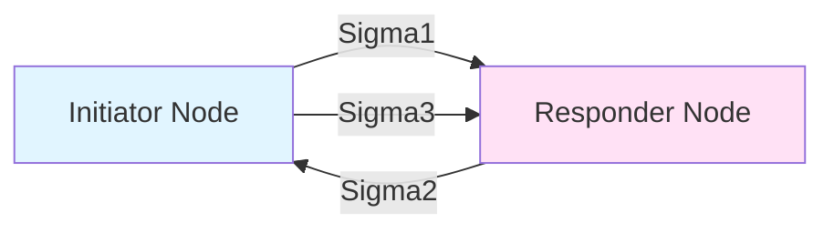

---

## Message Flow Diagram

### Complete CASE Session Establishment

```mermaid
sequenceDiagram
    participant I as Initiator
    participant R as Responder

    Note over I,R: Phase 1: Session Initiation

    I->>I: Generate initiatorRandom (32 bytes)
    I->>I: Generate InitiatorEphKeyPair (ECDH)
    I->>I: Generate InitiatorSessionId
    I->>I: Compute DestinationIdentifier<br/>(encrypted with IPK)

    I->>R: Sigma1 {<br/>  initiatorRandom,<br/>  InitiatorSessionId,<br/>  DestinationIdentifier,<br/>  InitiatorEphPubKey<br/>}

    Note over I,R: Phase 2: Responder Authentication

    R->>R: Decrypt DestinationIdentifier<br/>(find Fabric & Node ID)
    R->>R: Generate responderRandom (32 bytes)
    R->>R: Generate ResponderEphKeyPair (ECDH)
    R->>R: Compute SharedSecret = ECDH(...)
    R->>R: Derive S2K key (HKDF)
    R->>R: Prepare responderNOC + ICAC (if any)
    R->>R: Sign TBSData2 with NOC private key

    R->>I: Sigma2 {<br/>  responderRandom,<br/>  ResponderSessionId,<br/>  ResponderEphPubKey,<br/>  encrypted2 (S2K) {<br/>    responderNOC,<br/>    responderICAC,<br/>    signature,<br/>    resumptionID<br/>  }<br/>}

    Note over I,R: Phase 3: Initiator Authentication

    I->>I: Compute SharedSecret = ECDH(...)
    I->>I: Derive S2K key (HKDF)
    I->>I: Decrypt & verify encrypted2
    I->>I: Validate certificate chain:<br/>  RCAC → ICAC → NOC
    I->>I: Verify responder signature
    I->>I: Check Fabric ID matches
    I->>I: Derive S3K key (HKDF)
    I->>I: Sign TBSData3 with NOC private key

    I->>R: Sigma3 {<br/>  encrypted3 (S3K) {<br/>    initiatorNOC,<br/>    initiatorICAC,<br/>    signature<br/>  }<br/>}

    Note over I,R: Phase 4: Session Establishment

    R->>R: Derive S3K key (HKDF)
    R->>R: Decrypt & verify encrypted3
    R->>R: Validate certificate chain
    R->>R: Verify initiator signature
    R->>R: Check Fabric ID cross-check
    R->>R: Derive I2RKey, R2IKey (session keys)
    R->>R: Initialize message counter

    I->>I: Derive I2RKey, R2IKey (session keys)
    I->>I: Initialize message counter

    Note over I,R: ✅ Secure Session Established

    I->>R: Encrypted Application Data
    R->>I: Encrypted Application Data
```

---

## State Machine

### CASE Protocol State Transitions

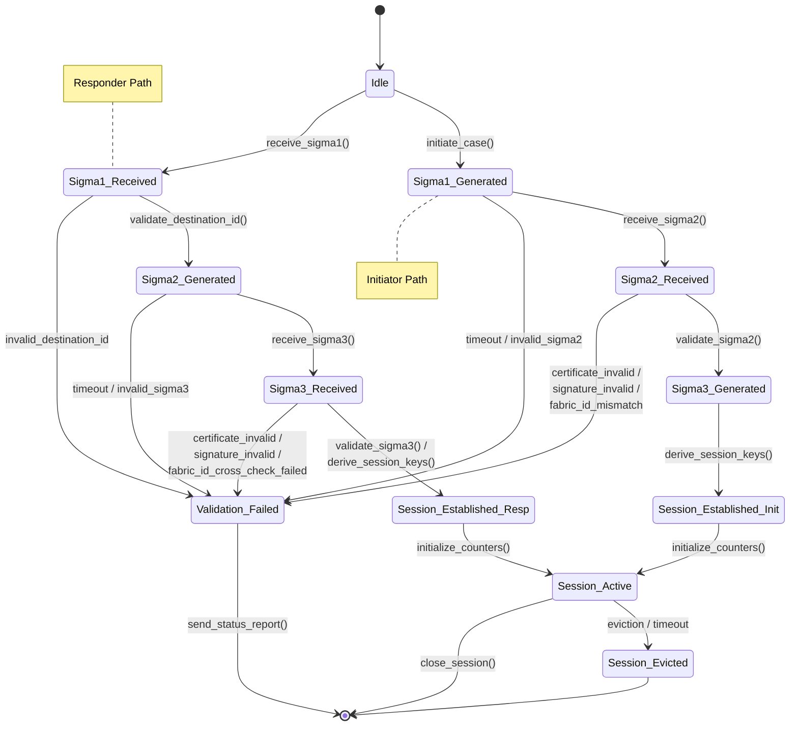

---

## Key Derivation Flow

### Complete Key Hierarchy

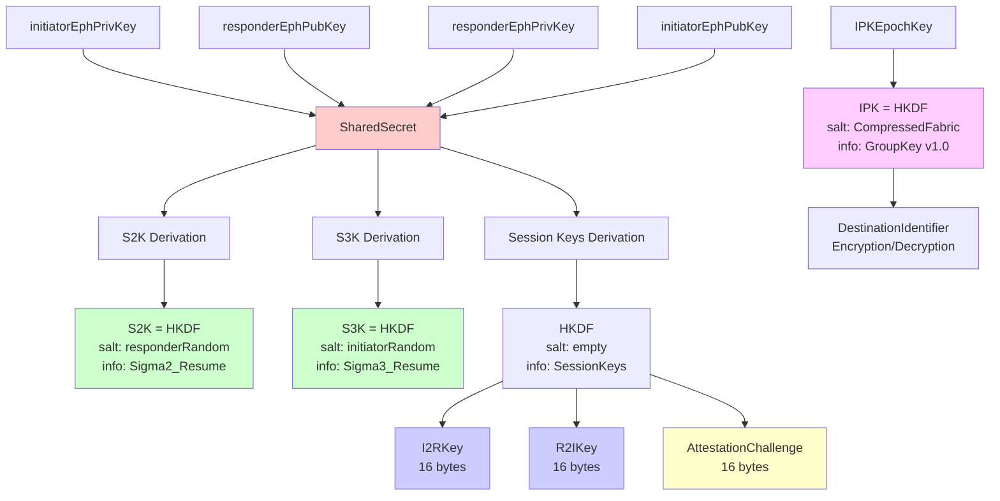

### Key Derivation Details

#### 1. **Shared Secret** (ECDH)

```
SharedSecret = Crypto_ECDH(
    myPrivateKey = InitiatorEphKeyPair.privateKey,
    theirPublicKey = Msg2.responderEphPubKey
)
```

#### 2. **S2K Key** (Sigma2 Encryption)

```
S2K = HKDF(
    inputKey = SharedSecret,
    salt = responderRandom,
    info = "Sigma2",
    len = 16 bytes
)
```

#### 3. **S3K Key** (Sigma3 Encryption)

```
S3K = HKDF(
    inputKey = SharedSecret,
    salt = initiatorRandom,
    info = "Sigma3",
    len = 16 bytes
)
```

#### 4. **Session Keys**

```
SEKeys = HKDF(
    inputKey = SharedSecret,
    salt = empty,
    info = "SessionKeys",
    len = 48 bytes
)

I2RKey = SEKeys[0:15]   // Initiator → Responder
R2IKey = SEKeys[16:31]  // Responder → Initiator
AttestationChallenge = SEKeys[32:47]
```

#### 5. **IPK** (Identity Protection Key)

```
IPK = HKDF(
    inputKey = IPKEpochKey,
    salt = CompressedFabricIdentifier,
    info = "GroupKey v1.0",
    len = 16 bytes
)
```

---

## Certificate Validation

### Certificate Chain Structure

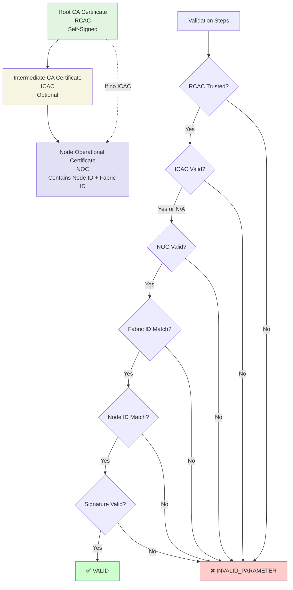

### Sigma2 Certificate Validation (Initiator Side)

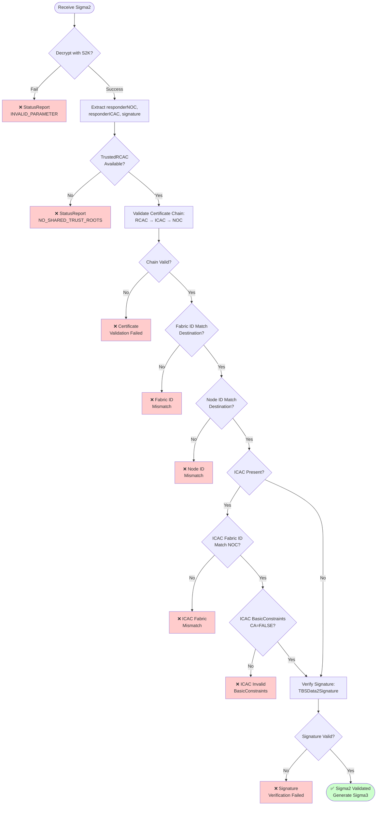

### Sigma3 Certificate Validation (Responder Side)

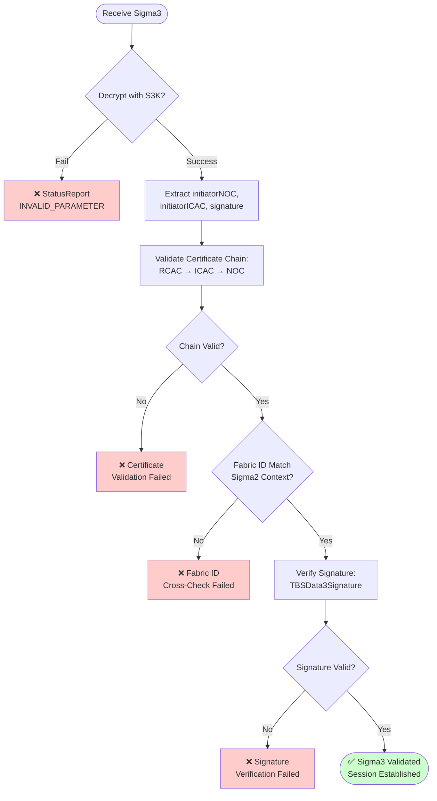

---

## Security Properties

### Authentication Properties

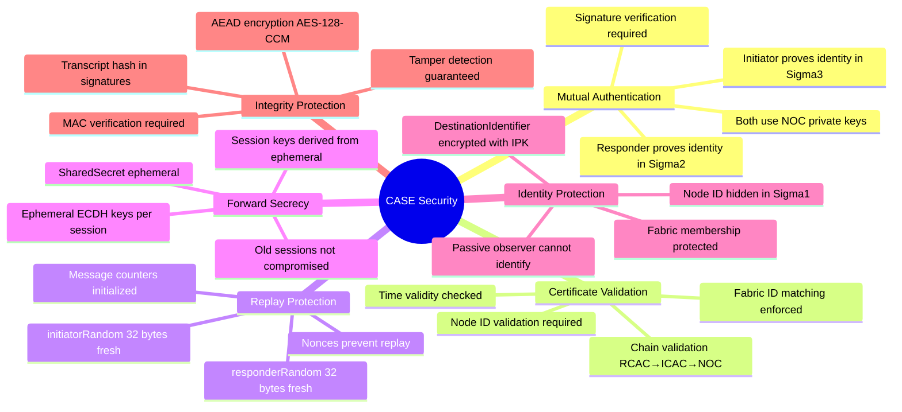

---

## Error Scenarios

### Error Handling Flow

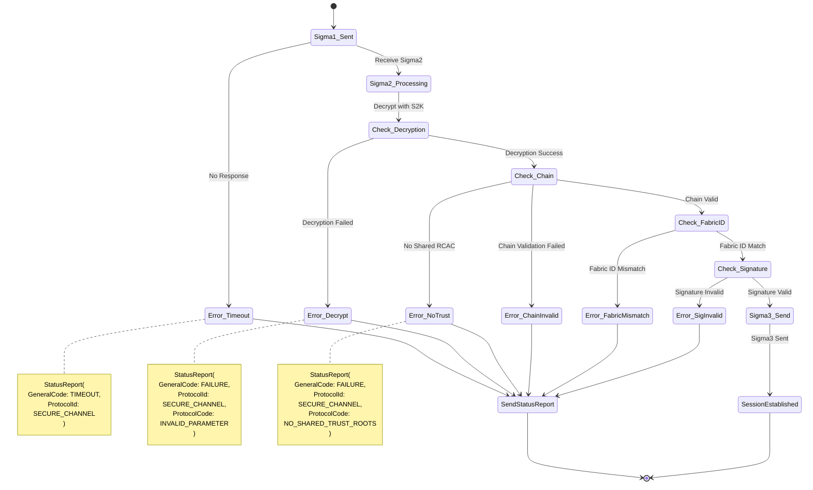

### Common Error Codes

| Error Code                | General Code | Protocol Code                | Scenario                             |
| ------------------------- | ------------ | ---------------------------- | ------------------------------------ |
| **Timeout**               | TIMEOUT      | N/A                          | No Sigma2/Sigma3 response            |
| **Invalid Parameter**     | FAILURE      | INVALID_PARAMETER            | Decryption failed, signature invalid |
| **No Shared Trust**       | FAILURE      | NO_SHARED_TRUST_ROOTS        | No common RCAC found                 |
| **Busy**                  | BUSY         | N/A                          | Node cannot accept new session       |
| **Session Establishment** | FAILURE      | SESSION_ESTABLISHMENT_FAILED | Generic establishment error          |

---

## Message Structures

### Sigma1 Message

```
Sigma1 = STRUCTURE {
  initiatorRandom        [1] : OCTET STRING (32 bytes),
  initiatorSessionId     [2] : uint16,
  destinationId          [3] : OCTET STRING (encrypted),
  initiatorEphPubKey     [4] : OCTET STRING (65 bytes, uncompressed),
  initiatorSessionParams [5] : session-parameter-struct (OPTIONAL),
  resumptionID           [6] : OCTET STRING (OPTIONAL),
  initiatorResumeMIC     [7] : OCTET STRING (OPTIONAL)
}
```

### Sigma2 Message

```
Sigma2 = STRUCTURE {
  responderRandom        [1] : OCTET STRING (32 bytes),
  responderSessionId     [2] : uint16,
  responderEphPubKey     [3] : OCTET STRING (65 bytes, uncompressed),
  encrypted2             [4] : OCTET STRING (AEAD-encrypted),
  responderSessionParams [5] : session-parameter-struct (OPTIONAL)
}

TBEData2 (encrypted with S2K) = STRUCTURE {
  responderNOC    [1] : OCTET STRING,
  responderICAC   [2] : OCTET STRING (OPTIONAL),
  signature       [3] : OCTET STRING (ECDSA signature),
  resumptionID    [4] : OCTET STRING (OPTIONAL)
}
```

### Sigma3 Message

```
Sigma3 = STRUCTURE {
  encrypted3 [1] : OCTET STRING (AEAD-encrypted)
}

TBEData3 (encrypted with S3K) = STRUCTURE {
  initiatorNOC  [1] : OCTET STRING,
  initiatorICAC [2] : OCTET STRING (OPTIONAL),
  signature     [3] : OCTET STRING (ECDSA signature)
}
```

---

## Session Resumption Flow

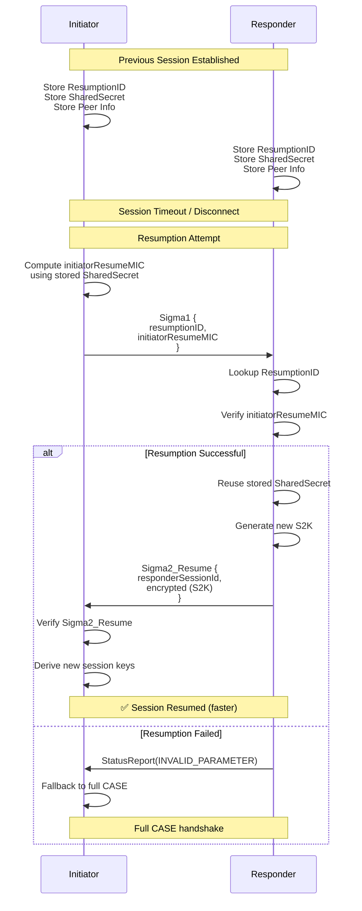

---

## Cryptographic Algorithms

### Algorithm Summary

| Operation     | Algorithm         | Key Size | Details                  |
| ------------- | ----------------- | -------- | ------------------------ |
| **ECDH**      | P-256 (secp256r1) | 256-bit  | Ephemeral key exchange   |
| **Signature** | ECDSA-SHA256      | 256-bit  | NOC private key signing  |
| **AEAD**      | AES-128-CCM       | 128-bit  | Message encryption       |
| **KDF**       | HKDF-SHA256       | Variable | Key derivation           |
| **Hash**      | SHA-256           | 256-bit  | Transcript hashing       |
| **DRBG**      | CTR-DRBG          | N/A      | Random number generation |

### Nonce Construction

```
Nonce (13 bytes) = {
  SecurityFlags (1 byte),
  MessageCounter (4 bytes),
  NodeID (8 bytes)
}
```

---

## Timing Diagram

### Typical Session Establishment Time

```mermaid
gantt
    title CASE Session Establishment Timeline
    dateFormat X
    axisFormat %L ms

    section Initiator
    Generate Keys & Sigma1  :a1, 0, 20
    Wait for Sigma2         :a2, 20, 50
    Validate Sigma2         :a3, 70, 30
    Generate Sigma3         :a4, 100, 15
    Derive Session Keys     :a5, 115, 10

    section Network
    Sigma1 Transmission     :b1, 20, 5
    Sigma2 Transmission     :b2, 65, 5
    Sigma3 Transmission     :b3, 115, 5

    section Responder
    Wait for Sigma1         :c1, 0, 25
    Validate Sigma1         :c2, 25, 20
    Generate Sigma2         :c3, 45, 20
    Wait for Sigma3         :c4, 70, 50
    Validate Sigma3         :c5, 120, 15
    Derive Session Keys     :c6, 135, 10

    section Result
    Session Active          :milestone, 145, 0
```

**Typical Timing:**

- Full CASE: ~100-150ms (depending on network latency)
- Resumption: ~50-80ms (skips certificate validation)

---

## Security Analysis Summary

### ✅ HOLDS Properties (43)

- Mutual authentication verified
- Certificate chain validation enforced
- Ephemeral key exchange per session
- Session key derivation correct
- Replay protection via nonces
- Signature verification required
- Fabric ID matching enforced
- Message integrity via AEAD
- Transcript binding prevents MITM

### ⚠️ PARTIALLY_HOLDS Properties (5)

1. **IPK Exclusive Use** - Spec allows "second newest" epoch key
2. **Node ID Match Validation** - Required but enforcement implicit
3. **Certificate DN Encoding** - Validation specified but not always enforced
4. **Node ID Range Validation** - Checked in AddNOC but not during CASE
5. **ICAC Basic Constraints** - Required CA=FALSE but validation optional

### ❌ Specification Gaps (3)

1. **No CRL/OCSP During CASE** - Relies on ACL updates, not real-time revocation
2. **IPK Epoch Transition Window** - Brief window where old IPK valid
3. **Authentication Asymmetry** - Responder reveals identity first in Sigma2

### 🔒 UNVERIFIABLE Properties (10)

- Implementation-dependent (HSM usage, timing attacks, key zeroization, etc.)

---

## References

- **Matter Specification R1.4** - Section 4.14.2 (Pages 171-194)
- **Cryptographic Primitives** - Section 3.5-3.10 (Pages 71-85)
- **Certificate Format** - Section 6.5 (Pages 324-390)
- **Message Counters** - Section 4.6 (Pages 126-133)
- **Session Management** - Section 4.13 (Pages 161-164)

---

**Document Version:** 1.0  
**Last Updated:** February 3, 2026  
**Status:** Formal Verification Complete ✅
