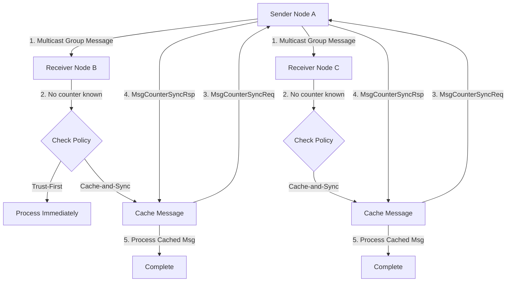
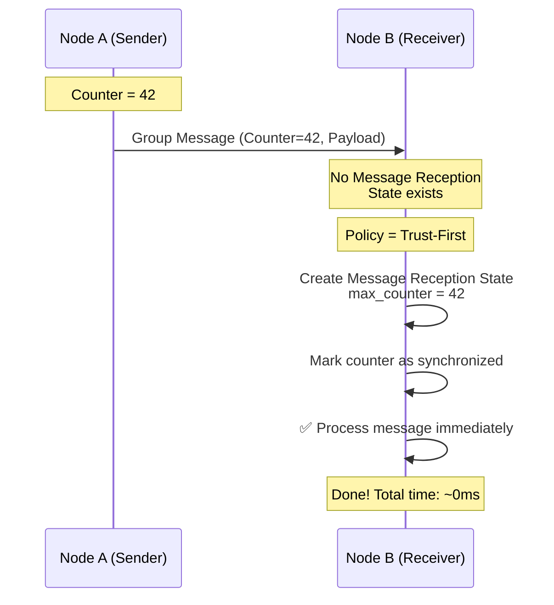
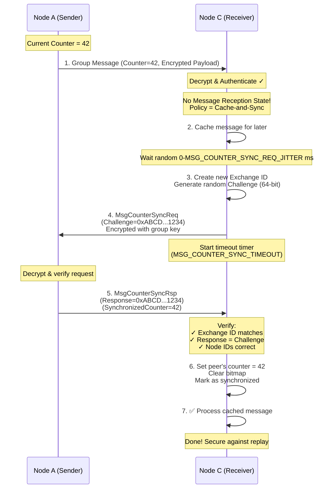
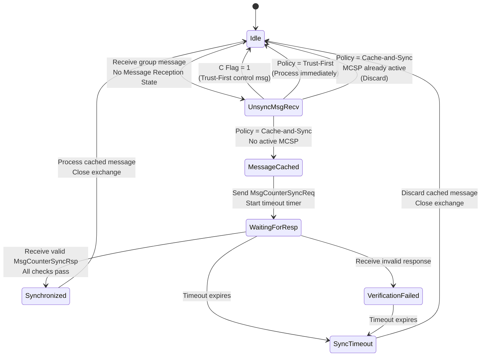
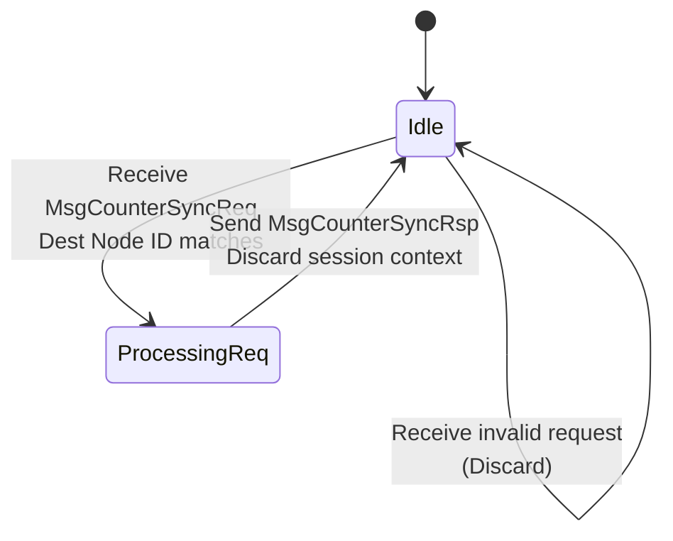

# MCSP Protocol Flow - Detailed Explanation

## Message Counter Synchronization Protocol (Section 4.18)

**Matter Specification v1.4**  
**Generated:** 2026-01-19

---

## Table of Contents

1. [Protocol Overview](#protocol-overview)
2. [Two Synchronization Policies](#two-synchronization-policies)
3. [Trust-First Flow](#trust-first-flow)
4. [Cache-and-Sync Flow](#cache-and-sync-flow)
5. [Message Formats](#message-formats)
6. [State Machine](#state-machine)
7. [Complete Example Scenarios](#complete-example-scenarios)
8. [Timing and Constraints](#timing-and-constraints)

---

## Protocol Overview

### Purpose

MCSP ensures that nodes receiving encrypted group messages can **securely synchronize message counters** to prevent replay attacks.

### Key Concept

- **Problem:** When a node receives a message from a peer whose counter is unknown, it cannot verify if the message is fresh or replayed.
- **Solution:** MCSP allows the receiver to request the sender's current counter via a secure challenge-response exchange.

### Architecture



---

## Two Synchronization Policies

### 1. Trust-First Policy

**Characteristics:**

- ✅ **Low latency** - immediate processing
- ⚠️ **Lower security** - vulnerable to replay after reboot
- 🎯 **Use case:** Less security-sensitive apps (e.g., lighting)

**How it works:**

```
Receiver gets unsynchronized message
  ↓
Trust the message counter immediately
  ↓
Create Message Reception State with this counter
  ↓
Process message right away
```

### 2. Cache-and-Sync Policy

**Characteristics:**

- ✅ **High security** - replay protection even after reboot
- ⚠️ **Higher latency** - requires round-trip exchange
- 🎯 **Use case:** Security-sensitive applications

**How it works:**

```
Receiver gets unsynchronized message
  ↓
Cache the message (don't process yet)
  ↓
Request counter from sender (MCSP exchange)
  ↓
Verify response
  ↓
Update counter state
  ↓
Process cached message
```

---

## Trust-First Flow

### Sequence Diagram



### Step-by-Step Process

1. **Sender broadcasts group message**
   - Message Counter: 42
   - Encrypted with group key
   - C Flag = 0 (data message)

2. **Receiver decrypts and authenticates**
   - Verifies message using group key
   - Extracts Source Node ID

3. **Check for Message Reception State**
   - Lookup: Does state exist for this sender + group key?
   - Result: ❌ No state found

4. **Apply Trust-First**
   - Create new Message Reception State
   - Set `max_message_counter = 42`
   - Clear bitmap (all zeros)
   - Mark as synchronized

5. **Process Message**
   - Execute application logic
   - Message is trusted immediately

### Trust-First Risk

⚠️ **WARNING from Spec:**

```
Trust-first synchronization is susceptible to accepting
a replayed message after a Node has been rebooted.
```

**Example Attack:**

```
Day 1: Node B receives message with counter=42 (trust-first)
Day 2: Node B reboots, loses Message Reception State
Day 2: Attacker replays old message with counter=42
Day 2: Node B trusts it again (no state to detect replay) ❌
```

---

## Cache-and-Sync Flow

### Complete Sequence Diagram



### Detailed Step-by-Step

#### Phase 1: Message Reception and Caching

**Step 1: Sender broadcasts group message**

```
Message Header:
  - S Flag = 1 (source node ID present)
  - Session Type = 1 (Group)
  - Source Node ID = A
  - Message Counter = 42
Payload:
  - Encrypted with operational group key
  - Contains application data
```

**Step 2: Receiver processes**

```
Actions:
  ✓ Decrypt with group key
  ✓ Verify authentication
  ✓ Extract Source Node ID (A)
  ✓ Check Message Reception State for (Node A, Group Key)
  ✗ Not found!
```

**Step 3: Determine policy**

```
GroupKeySecurityPolicy = cache-and-sync
  ↓
Store message for later processing
Set state = "MessageCached"
```

#### Phase 2: Synchronization Request

**Step 4: Prepare synchronization request**

```
Wait time = Random(0, MSG_COUNTER_SYNC_REQ_JITTER)
  ↓
Create new Exchange ID (e.g., eid_001)
Generate Challenge = Crypto_DRBG(64 bits) = 0xABCD...1234
  ↓
Store in active_exchange table:
  - Initiator: C
  - Responder: A
  - Exchange ID: eid_001
  - Challenge: 0xABCD...1234
```

**Step 5: Build MsgCounterSyncReq**

```
Message Header:
  - S Flag = 1
  - DSIZ = 1 (destination node ID present)
  - P Flag = 1 (privacy)
  - C Flag = 1 (control message - uses control counter)
  - Session Type = 1 (Group)
  - Session ID = Group Session ID
  - Source Node ID = C
  - Destination Node ID = A
  - Exchange ID = eid_001
  - I Flag = 1 (initiator)
  - A Flag = 0 (not acknowledgment)
  - R Flag = 1 (reliable message)
Payload:
  - Challenge = 0xABCD...1234 (8 bytes)
Encryption:
  - Encrypted with group key
  - Sent via unicast UDP to Node A's IPv6 address
```

**Step 6: Start timeout**

```
Arm timer: MSG_COUNTER_SYNC_TIMEOUT
On timeout:
  - Close exchange
  - Discard cached message
  - Peer remains unsynchronized
```

#### Phase 3: Sender Responds

**Step 7: Sender receives request**

```
Actions:
  ✓ Decrypt with group key
  ✓ Verify Destination Node ID = A (self)
  ✓ Extract Challenge = 0xABCD...1234
  ✓ Extract Exchange ID = eid_001
  ✓ Extract Source Node ID = C (requester)
```

**Step 8: Build MsgCounterSyncRsp**

```
Message Header:
  - S Flag = 1
  - DSIZ = 1
  - P Flag = 1
  - C Flag = 1 (control message)
  - Session Type = 1 (Group)
  - Session ID = Group Session ID
  - Source Node ID = A
  - Destination Node ID = C
  - Exchange ID = eid_001 (same as request!)
  - I Flag = 0 (not initiator)
  - A Flag = 1 (acknowledgment)
  - R Flag = 1 (reliable message)
Payload:
  - Synchronized Counter = 42 (4 bytes)
  - Response = 0xABCD...1234 (8 bytes, echoes Challenge)
Encryption:
  - Encrypted with group key
  - Sent via unicast UDP to Node C's IPv6 address
```

#### Phase 4: Response Verification

**Step 9: Receiver verifies response**

```
Verification checks:
  ✓ Active exchange exists with Source Node = A
  ✓ Exchange ID in response = eid_001 (matches request)
  ✓ Response field = 0xABCD...1234 (matches Challenge)
  ✓ Destination Node ID = C (matches self)
  ✓ Source Node ID = A (matches request's destination)

If ANY check fails:
  ❌ Silently ignore response
  ⏱️ Wait for timeout

If ALL checks pass:
  ✅ Stop timeout timer
  ✅ Proceed to synchronization
```

#### Phase 5: Counter Synchronization

**Step 10: Update peer state**

```
Actions:
  1. Set peer's group key data message counter = 42
  2. Clear Message Reception State bitmap
  3. Mark peer's counter as synchronized
  4. Record in peer_state table:
       - Receiver: C
       - Sender: A
       - Group Key: <key>
       - Max Counter: 42
```

**Step 11: Process cached message**

```
Retrieve cached message from Step 3
Apply normal counter processing (Section 4.6.7):
  - Counter 42 > max_counter - window_size
  - Not in bitmap (first message)
  - Accept as valid
Process application payload
Close synchronization exchange
```

---

## Message Formats

### MsgCounterSyncReq

```
┌─────────────────────────────────────────┐
│         Message Header                  │
├─────────────────────────────────────────┤
│  Version: 0                             │
│  S Flag: 1                              │
│  DSIZ: 1                                │
│  P Flag: 1                              │
│  C Flag: 1 ← Control message            │
│  Session Type: 1 ← Group                │
│  Session ID: Group Session ID           │
│  Source Node ID: Initiator              │
│  Dest Node ID: Responder                │
│  Exchange ID: <unique>                  │
│  I Flag: 1, A Flag: 0, R Flag: 1        │
├─────────────────────────────────────────┤
│         Payload (12 bytes total)        │
├─────────────────────────────────────────┤
│  Challenge (8 bytes): Random 64-bit     │
└─────────────────────────────────────────┘
```

### MsgCounterSyncRsp

```
┌─────────────────────────────────────────┐
│         Message Header                  │
├─────────────────────────────────────────┤
│  Version: 0                             │
│  S Flag: 1                              │
│  DSIZ: 1                                │
│  P Flag: 1                              │
│  C Flag: 1 ← Control message            │
│  Session Type: 1 ← Group                │
│  Session ID: Group Session ID           │
│  Source Node ID: Responder              │
│  Dest Node ID: Initiator                │
│  Exchange ID: <same as request>         │
│  I Flag: 0, A Flag: 1, R Flag: 1        │
├─────────────────────────────────────────┤
│         Payload (12 bytes total)        │
├─────────────────────────────────────────┤
│  Synchronized Counter (4 bytes): uint32 │
│  Response (8 bytes): Echo of Challenge  │
└─────────────────────────────────────────┘
```

---

## State Machine

### Initiator State Machine



### Responder State Machine



---

## Complete Example Scenarios

### Scenario 1: Trust-First (Node B)

```
Timeline:
T=0ms    Sender A multicasts: "Turn on light" (Counter=42)
         ↓
T=1ms    Receiver B receives message
         B decrypts: ✓ valid
         B checks state: ❌ none for Node A
         B checks policy: Trust-First
         ↓
T=2ms    B creates Message Reception State:
           max_message_counter = 42
           bitmap = [0,0,0,0...] (all clear)
           synchronized = true
         ↓
T=3ms    B processes: ✅ "Turn on light"
         DONE - Total latency: 3ms
```

### Scenario 2: Cache-and-Sync (Node C)

```
Timeline:
T=0ms    Sender A multicasts: "Turn on light" (Counter=42)
         ↓
T=1ms    Receiver C receives message
         C decrypts: ✓ valid
         C checks state: ❌ none for Node A
         C checks policy: Cache-and-Sync
         ↓
T=2ms    C caches message in memory
         C waits jitter: Random(0-500ms) = 120ms
         ↓
T=122ms  C creates Exchange ID: eid_42
         C generates Challenge: 0x123456789ABCDEF0
         C stores active_exchange(C, A, key, eid_42, challenge)
         ↓
T=123ms  C sends MsgCounterSyncReq to A:
           Exchange ID = eid_42
           Challenge = 0x123456789ABCDEF0
         C starts timeout timer: 5000ms
         ↓
T=125ms  A receives request
         A verifies: ✓ Dest=A, valid encryption
         A extracts: Challenge = 0x123456789ABCDEF0
         ↓
T=126ms  A sends MsgCounterSyncRsp to C:
           Exchange ID = eid_42
           Response = 0x123456789ABCDEF0
           Synchronized Counter = 42
         ↓
T=128ms  C receives response
         C verifies:
           ✓ Exchange ID = eid_42
           ✓ Response = 0x123456789ABCDEF0
           ✓ Dest = C
           ✓ Source = A
         ↓
T=129ms  C stops timeout timer
         C updates peer_state(C, A, key, counter=42)
         C marks A as synchronized
         ↓
T=130ms  C retrieves cached message
         C processes: ✅ "Turn on light"
         C closes exchange
         DONE - Total latency: 130ms
```

### Scenario 3: Verification Failure

```
Timeline:
T=0ms    Sender A multicasts message (Counter=42)
         ↓
T=120ms  Receiver C sends MsgCounterSyncReq
           Exchange ID = eid_100
           Challenge = 0xAAAA
         ↓
T=125ms  💀 ATTACKER intercepts and modifies response:
           Changes Response to 0xBBBB (wrong!)
         ↓
T=128ms  C receives modified response
         C verifies:
           ✓ Exchange ID = eid_100 (OK)
           ❌ Response = 0xBBBB ≠ 0xAAAA (FAIL!)
         ↓
T=129ms  C silently ignores response
         C keeps timer running
         ↓
T=5120ms Timeout expires (5000ms from T=120ms)
         C closes exchange
         C discards cached message
         DONE - Message rejected ✓ Secure!
```

### Scenario 4: Multiple Receivers

```
Timeline:
T=0ms    Sender A multicasts to group (100 receivers)
         ↓
T=1ms    All 100 receivers get message
         All have no Message Reception State
         ↓
         50 use Trust-First → Process immediately
         50 use Cache-and-Sync → Need to sync
         ↓
T=2ms    50 Cache-and-Sync receivers:
         Each waits random jitter: 0-500ms
         (Prevents thundering herd!)
         ↓
T=2-502ms Staggered MsgCounterSyncReq to A:
         T=2ms:   Receiver 1 sends request
         T=45ms:  Receiver 2 sends request
         T=89ms:  Receiver 3 sends request
         ... (spread over 500ms)
         T=501ms: Receiver 50 sends request
         ↓
T=5-505ms A responds to each request individually
         A sends 50 unicast MsgCounterSyncRsp messages
         ↓
T=10-510ms All 50 receivers process cached messages
         ✅ All synchronized without overload
```

---

## Timing and Constraints

### Constants

| Constant                      | Purpose                                 | Typical Value |
| ----------------------------- | --------------------------------------- | ------------- |
| `MSG_COUNTER_SYNC_REQ_JITTER` | Max random delay before sending request | 500ms         |
| `MSG_COUNTER_SYNC_TIMEOUT`    | Max wait time for response              | 5000ms        |
| `MSG_COUNTER_WINDOW_SIZE`     | Bitmap size for duplicate detection     | 32 bits       |

### Table Size Requirements

From Section 4.18.2:

```
Group Peer State Table:
  ✓ At least 10 entries per fabric for Data Message Status
  ✓ SHOULD NOT be less than 5 entries per fabric per Groups cluster
  ✓ At least 2 entries per fabric for Control Message Status

Active MCSP Exchanges:
  ✓ At most ONE exchange per (peer Node ID, group key) pair
```

### Performance Implications

**Trust-First:**

```
Latency:     ~1-5ms        (immediate)
CPU:         Low           (no extra messages)
Network:     0 extra msgs
Security:    ⚠️ Medium     (reboot vulnerability)
```

**Cache-and-Sync:**

```
Latency:     ~100-200ms    (round-trip + jitter)
CPU:         Medium        (crypto + state management)
Network:     +2 msgs       (req + rsp per peer)
Security:    ✅ High       (full replay protection)
```

**Large Group Warning:**

```
Scenario: 100 nodes receive multicast from new sender
Result:   100 × MsgCounterSyncReq to sender
Impact:   Potential DoS on sender
Mitigation:
  - Random jitter spreads load over 0-500ms
  - Sender processes 100÷0.5 = 200 req/sec (manageable)
```

---

## Key Security Properties

### 1. Replay Protection

```
WITHOUT MCSP:
  Attacker captures message at T=100
  Attacker replays at T=200
  Receiver has no counter → accepts replay ❌

WITH MCSP (Cache-and-Sync):
  Receiver synchronizes counter = 42 at T=100
  Attacker replays old message (counter=40) at T=200
  Receiver checks: 40 < 42 → REJECT ✓
```

### 2. Challenge-Response Freshness

```
Attacker captures old MsgCounterSyncRsp:
  Response = 0x1111
  Counter = 40

Victim sends new MsgCounterSyncReq:
  Challenge = 0x2222

Attacker replays old response:
  Response = 0x1111

Victim verifies:
  0x1111 ≠ 0x2222 → REJECT ✓
```

### 3. Authentication

```
Only nodes with GROUP KEY can:
  ✓ Decrypt MsgCounterSyncReq
  ✓ Create valid MsgCounterSyncRsp
  ✓ Process group messages

Attacker without key:
  ❌ Cannot read Challenge
  ❌ Cannot forge Response
  ❌ Cannot inject fake counter
```

---

## Summary

### When to Use Each Policy

| Use Trust-First When:         | Use Cache-and-Sync When:         |
| ----------------------------- | -------------------------------- |
| ✅ Low latency critical       | ✅ Security critical             |
| ✅ Lighting, simple controls  | ✅ Locks, alarms, access control |
| ✅ Nodes rarely reboot        | ✅ Nodes may reboot              |
| ✅ Replay risk acceptable     | ✅ Need full replay protection   |
| ✅ Control messages (always!) | ✅ Data messages in secure apps  |

### Protocol Guarantees

✅ **Authentication:** Only group key holders can participate  
✅ **Freshness:** Challenge-response prevents replay  
✅ **Confidentiality:** All messages encrypted  
✅ **Integrity:** Modification detected via auth tag  
✅ **Replay Protection:** Counter synchronization prevents old messages

### Implementation Checklist

- [ ] Implement both trust-first and cache-and-sync policies
- [ ] Generate cryptographically secure 64-bit challenges (DRBG)
- [ ] Enforce MSG_COUNTER_SYNC_TIMEOUT (5 seconds typical)
- [ ] Apply random jitter (0-500ms) before sending requests
- [ ] Maintain Group Peer State Table (≥10 entries/fabric)
- [ ] Enforce "one exchange per peer-key pair" rule
- [ ] Verify all 5 checks on MsgCounterSyncRsp
- [ ] Use control counter (C Flag=1) for MCSP messages
- [ ] Persist peer state when possible (anti-reboot replay)
- [ ] Handle verification failures silently (no error messages)

---

**Document Version:** 1.0  
**Source:** Matter Specification v1.4, Section 4.18  
**For Questions:** Refer to FSM model and ProVerif verification
