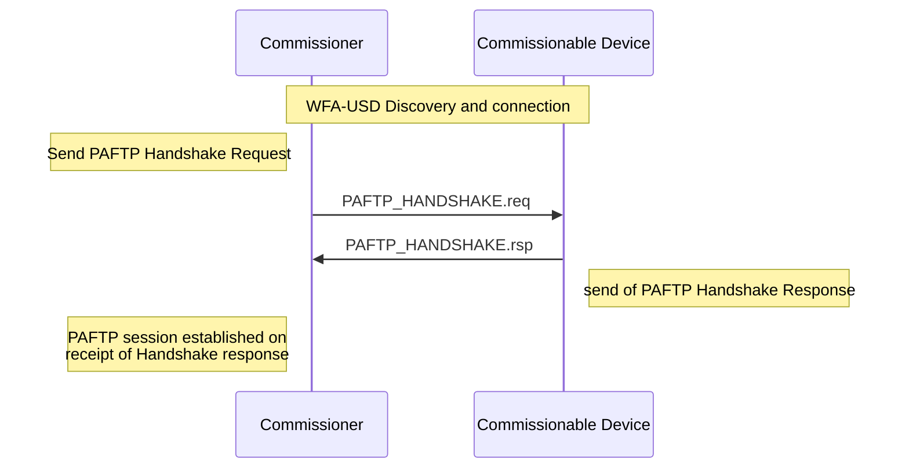
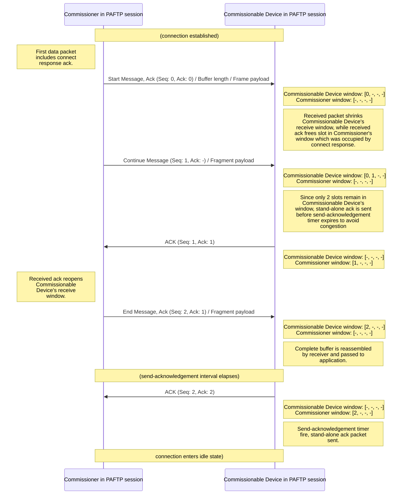
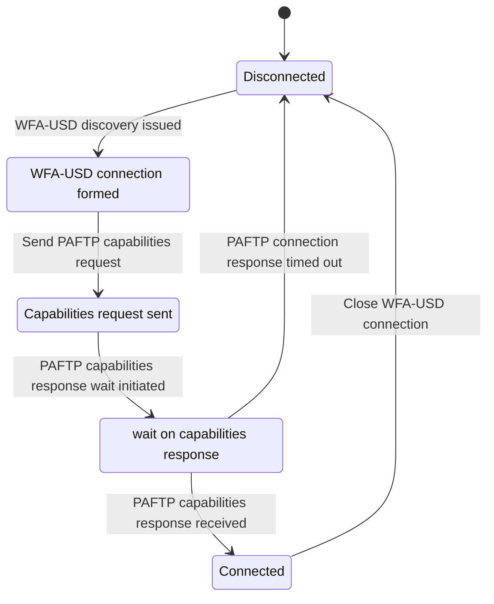
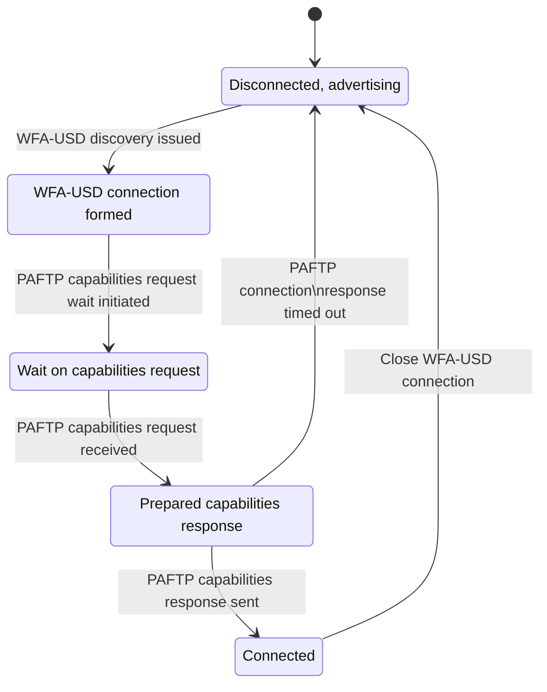
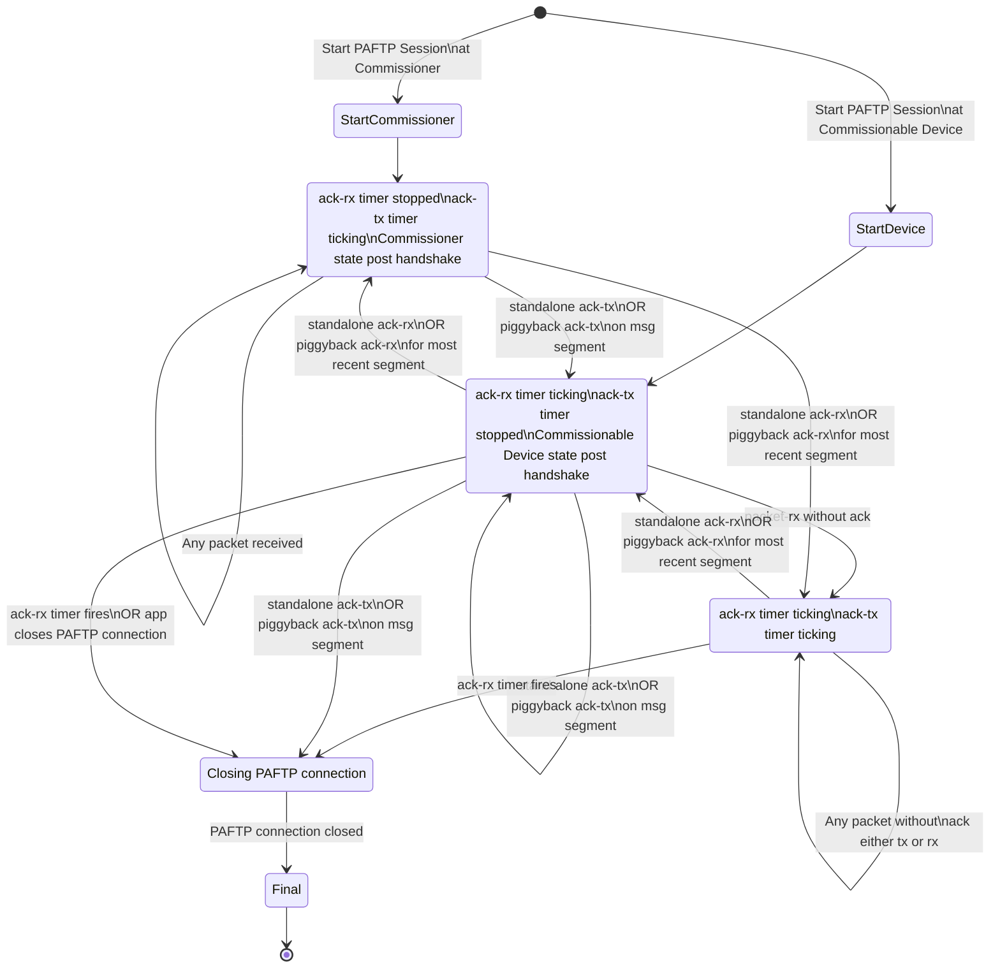
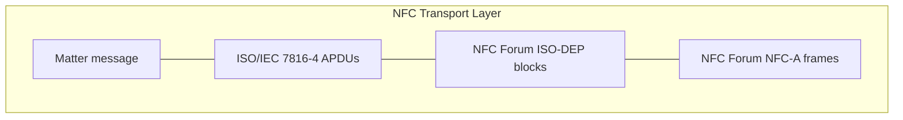

<table>
  <tbody>
    <tr>
        <td>Constant Name</td>
        <td>Description</td>
        <td>Default</td>
    </tr>
    <tr>
        <th>BTP_CONN_RSP_TIMEOUT</th>
        <th>The maximum amount of time after sending a BTP Session Handshake request to wait for a BTP Session Handshake response before closing the connection.</th>
        <th>5 seconds</th>
    </tr>
    <tr>
        <th>BTP_ACK_TIMEOUT</th>
        <th>The maximum amount of time after receipt of a segment before a stand-alone ACK must be sent.</th>
        <th>15 seconds</th>
    </tr>
    <tr>
        <th>BTP_CONN_IDLE_TIMEOUT</th>
        <th>The maximum amount of time no unique data has been sent over a BTP session before the Central Device must close the BTP session.</th>
        <th>30 seconds</th>
    </tr>
  </tbody>
</table>

### 4.19.6. Bluetooth Requirements

The UUID is provided by Bluetooth SIG, Inc. and may only be used by its members in compliance with all terms and conditions of use issued by the Bluetooth SIG, Inc. For more information, visit https://www.bluetooth.com/specifications/assigned-numbers/16-bit-uuids-for-sdos.

Use of the Bluetooth extensions feature of this specification and specifically the MATTER_BLE_SERVICE_UUID is strictly prohibited unless the product is certified by both the Bluetooth SIG and the Connectivity Standards Alliance by a member of good standing of both organizations.

*Table 36. SIG UUID assignment*

<table>
  <tbody>
    <tr>
        <td>Constant Name</td>
        <td>Description</td>
        <td>Value</td>
    </tr>
    <tr>
        <th>MATTER_BLE_SERVICE_UUID</th>
        <th>The UUID for the Matter-over-BLE service as assigned by the Bluetooth SIG.</th>
        <th>0xFFF6</th>
    </tr>
  </tbody>
</table>

## 4.20. Public Action Frame Transport Protocol (PAFTP)

The Public Action Frame Transport Protocol (PAFTP) is akin to BTP. PAFTP is used when commissioning over Wi-Fi Public Action Frame while BTP is used when commissioning over Bluetooth.

Just like BTP, PAFTP provides a TCP-like layer of reliable, connection-oriented data transfer of Matter commissioning messages in the Service Specific Info field inside the Service Descriptor Extension Attribute inside WFA-USD Service Discovery Frame (SDF) Follow-up messages. The PAFTP splits Matter message SDU into multiple PAFTP segments, which are each transmitted via a single WFA-USD SDF Follow-up message (as shown in Figure 29, "MATTERoPAF: Matter Message / PAFTP layering"). Each WFA-USD SDF Follow-up message is transmitted via a single Wi-Fi Public Action Frame.

Matter uses PAFTP to define a Matter-over-PAF (MATTERoPAF) Interface. A MATTERoPAF Interface

SHALL implement PAFTP. A MATTERoPAF Interface SHALL only be used to transport Matter messages as PAFTP SDU.

<table>
    <tr>
        <th>Layer</th>
        <th>Content</th>
        <th></th>
        <th></th>
        <th></th>
    </tr>
    <tr>
        <td>**Matter App Layer**</td>
        <td>[colspan=4] Matter Message / PAFTP SDU</td>
        <td></td>
        <td></td>
        <td></td>
    </tr>
    <tr>
        <td>**PAFTP**</td>
        <td>PAFTP segment</td>
        <td>PAFTP segment</td>
        <td>...</td>
        <td>PAFTP segment</td>
    </tr>
    <tr>
        <td>**USD Follow-up Message**</td>
        <td>SDF Header</td>
        <td>SDEA attribute</td>
        <td>Other SDF fields</td>
        <td></td>
    </tr>
    <tr>
        <td>**Wi-Fi Public Action Frame**</td>
        <td>[colspan=2] 802.11 PHY and MAC header</td>
        <td>Payload</td>
        <td>FCS</td>
    </tr>
</table>*Figure 29. MATTERoPAF: Matter Message / PAFTP layering*

The PAFTP session handshake allows devices to check PAFTP protocol version compatibility and exchange other data before a PAFTP session is established. Once established, this session is used to send and receive PAFTP SDUs (such as Matter messages) as PAFTP Message Segments. A PAFTP session MAY open and close with no effect on the state of the underlying WFA-USD connection, except in the case where a PAFTP session is closed by the Commissionable Device. Either the Commissionable Device or the Commissioner MAY signal the end of a PAFTP session by closing the underlying WFA-USD connection.

Due chiefly to constraints put on design by resource-limited Wi-Fi chipsets supporting WFA-USD, PAFTP defines a receive window for each side of a session in units of WFA-USD Follow-up message PDUs. Each WFA-USD Follow-up message PDU is sent with a sequence number which the receiver uses to acknowledge receipt of each packet at the PAFTP layer and open its receive window from the sender’s perspective.

### 4.20.1. PAFTP Session Interface

Conceptually, an open PAFTP session is exposed to the next-higher session layer as a full-duplex message stream.

### 4.20.2. PAFTP Frame Format

The PAFTP frame format is identical to BTP frame format as shown in Table 28, “BTP Packet PDU format”. A PAFTP Frame consists of an 8-bit header followed by one or more optional fields. PAFTP

uses little endian encoding for any header fields larger than one byte in length.

Table 37, “PAFTP Packet PDU format” defines the PAFTP Packet PDU format.

Unused fields SHALL be set to '0'.

Table 37. PAFTP Packet PDU format

<table>
  <tbody>
    <tr>
        <td>bit 0</td>
        <td></td>
        <td>1</td>
        <td></td>
        <td>2</td>
        <td></td>
        <td>3</td>
        <td></td>
        <td>4</td>
        <td></td>
        <td>5</td>
        <td></td>
        <td>6</td>
        <td></td>
        <td>7</td>
        <td></td>
        <td>8</td>
        <td></td>
        <td>9</td>
        <td></td>
        <td>10</td>
        <td></td>
        <td>11</td>
        <td></td>
        <td>12</td>
        <td></td>
        <td>13</td>
        <td></td>
        <td>14</td>
        <td></td>
        <td>15</td>
        <td></td>
    </tr>
    <tr>
        <td colspan="8">Control Flags</td>
        <td colspan="8">[Management Opcode]</td>
        <td colspan="16"></td>
    </tr>
    <tr>
        <td colspan="8">[Ack Number]</td>
        <td colspan="8">[Sequence Number]</td>
        <td colspan="16"></td>
    </tr>
    <tr>
        <td colspan="16">[Message Length]</td>
        <td colspan="16"></td>
    </tr>
    <tr>
        <td colspan="16">[Segment Payload]...</td>
        <td colspan="16"></td>
    </tr>
    <tr>
        <td colspan="16">...</td>
        <td colspan="16"></td>
    </tr>
  </tbody>
</table>

### 4.20.2.1. Control Flags

Table 38. PAFTP Control Flags

<table>
  <tbody>
    <tr>
        <td>bit 7</td>
        <td></td>
        <td>6</td>
        <td></td>
        <td>5</td>
        <td></td>
        <td>4</td>
        <td></td>
        <td>3</td>
        <td></td>
        <td>2</td>
        <td></td>
        <td>1</td>
        <td></td>
        <td>0</td>
        <td></td>
    </tr>
    <tr>
        <td>-</td>
        <td>H</td>
        <td>M</td>
        <td>-</td>
        <td>A</td>
        <td>E</td>
        <td>C</td>
        <td>B</td>
        <td colspan="8"></td>
    </tr>
  </tbody>
</table>

**H (Handshake) bit**

Set to '0' for normal PAFTP packets. When set, this bit indicates a PAFTP handshake packet for session establishment and has a different packet format described below.

**M (Management Message) bit**

Indicates the presence ('1') or absence ('0') of the Management Opcode field. All segments of a message SHALL set this bit to the same value.

**A (Acknowledgement) bit**

Indicates the presence of the Ack Number field.

**E (Ending Segment) bit**

Set to '1' on the last segment of a PAFTP SDU and set to '0' for all other segments of the same PAFTP SDU. A segment MAY have both the Beginning and Ending bits set indicating that a full PAFTP SDU is included in the message. When set, the segment payload length is equal to the total remaining unreceived message data. When not set, the segment payload length is equal to the maximum allowable PAFTP session packet size minus header overhead.

**C (Continuing Segment) bit**

Set to '0' on the first segment of a PAFTP SDU and set to '1' for all remaining segments of the same PAFTP SDU.

**B (Beginning Segment) bit**

Set to '1' on the first segment of a PAFTP SDU and set to '0' for all remaining segments of the same PAFTP SDU. It indicates the presence of the Message Length field.

### 4.20.2.2. Ack Number

Optional field specified in Section 4.20.3.8, "Packet Acknowledgements".

### 4.20.2.3. Sequence Number

Mandatory field for regular data messages specified in Section 4.20.3.6, "Sequence Numbers".

### 4.20.2.4. Message Length

Optional field present in Beginning Segment only. Value indicates the length in bytes of the full message buffer to be transmitted. None of the PAFTP Packet PDU fields is included in the Message Length.

### 4.20.2.5. Segment Payload

Optional field containing a segment of the Service Data Unit (SDU) message in transmission to the receiver.

### 4.20.3. PAFTP Control Frames

PAFTP defines different control frame formats depending on the Management Opcode that is in the PAFTP Packet PDU header. Valid Management Opcodes for PAFTP Control Frames are defined in Table 39, "PAFTP Control codes".

Table 39. PAFTP Control codes

<table>
  <thead>
    <tr>
        <th>Management Opcode</th>
        <th>Name</th>
        <th>Description</th>
    </tr>
  </thead>
  <tbody>
    <tr>
        <td>0x6C</td>
        <td>Handshake</td>
        <td>Request and response for PAFTP session establishment</td>
    </tr>
  </tbody>
</table>

#### 4.20.3.1. PAFTP Handshake Request

Table 40. PAFTP Handshake Request format

<table>
  <thead>
    <tr>
        <th>bit 0</th>
        <th>1</th>
        <th>2</th>
        <th>3</th>
        <th>4</th>
        <th>5</th>
        <th>6</th>
        <th>7</th>
        <th>8</th>
        <th>9</th>
        <th>10</th>
        <th>11</th>
        <th>12</th>
        <th>13</th>
        <th>14</th>
        <th>15</th>
    </tr>
  </thead>
  <tbody>
    <tr>
        <td colspan="8">Control Flags = 0x65</td>
        <td colspan="8">Management Opcode = 0x6C</td>
    </tr>
    <tr>
        <td colspan="4">Ver[0]</td>
        <td colspan="4">Ver[1]</td>
        <td colspan="4">Ver[2]</td>
        <td colspan="4">Ver[3]</td>
    </tr>
    <tr>
        <td colspan="4">Ver[4]</td>
        <td colspan="4">Ver[5]</td>
        <td colspan="4">Ver[6]</td>
        <td colspan="4">Ver[7]</td>
    </tr>
    <tr>
        <td colspan="16">Supported Maximum Service Specific Info length</td>
    </tr>
    <tr>
        <td colspan="8">Commissioner Window Size</td>
        <td colspan="8"></td>
    </tr>
  </tbody>
</table>

**H (Handshake) bit**

Set to '1' for connection handshake messages.

**M (Management) bit**

Set to '1' for connection handshake messages.

**Ver[i] (Version) nibbles**

Used to negotiate the highest version capability between a Device pair. Supported versions are listed once each, newest first, in descending order. Unused version fields are filled with ‘0’.

The following values are defined:

*   0 — Unused field
*   4 — PAFTP as defined by Matter v1.5

**Supported Maximum Service Specific Info Length**

Supported Maximum Service Specific Info Length is a 16-bit unsigned integer field containing the maximum size of the service information that can be transmitted and received by the sender in Service Specific Info field in Service Descriptor Extension attribute in WFA-USD SDF Follow-up message. The PAFTP can query WFA-USD layer locally within a Device to determine Supported Maximum Service Specific Info Length. If PAFTP is not aware of the Supported Maximum Service Specific Info Length, the value SHALL be set to '350'.

**Commissioner Window Size**

Value of the maximum receive window size supported by the Commissioner, specified in units of PAFTP packets where each packet length may be up to Supported Maximum Service Specific Info Length bytes minus PAFTP header. This maximum was chosen so a single PAFTP segment can fit into a single WFA-USD SDF Follow-up message PDU.

### 4.20.3.2. PAFTP Handshake Response

Table 41. PAFTP Handshake Response format

<table>
  <tbody>
    <tr>
        <td>bit 0</td>
        <td>1</td>
        <td>2</td>
        <td>3</td>
        <td>4</td>
        <td>5</td>
        <td>6</td>
        <td>7</td>
        <td>8</td>
        <td>9</td>
        <td>10</td>
        <td>11</td>
        <td>12</td>
        <td>13</td>
        <td>14</td>
        <td>15</td>
    </tr>
    <tr>
        <td colspan="8">Control Flags = 0x65</td>
        <td colspan="8">Management Opcode = 0x6C</td>
    </tr>
    <tr>
        <td colspan="4">Final Protocol Version</td>
        <td colspan="4">Reserved</td>
        <td colspan="8">Selected Maximum Service Specific Info Length (low byte)...</td>
    </tr>
    <tr>
        <td colspan="8">...Selected Maximum Service Specific Info Length (high byte)</td>
        <td colspan="8">Selected Window Size</td>
    </tr>
  </tbody>
</table>

**H (Handshake) bit**

Set to '1' for session handshake messages.

**M (Management) bit**

Set to '1' for session handshake messages.

**Reserved**

Must be set to '0'.

**Final Protocol Version**

Value of the PAFTP protocol version selected by the Commissionable Device.

**Selected Maximum Service Specific Info Length**

Value of the maximum size of the service information that can be transmitted and received in Service Specific Info field in Service Descriptor Extension attribute in WFA-USD SDF Follow-up message for this WFA-USD connection, selected by the Commissionable Device as a 16-bit unsigned integer. The PAFTP can query WFA-USD layer locally within a Device to determine Supported Maximum Service Specific Info Length. If PAFTP is not aware of the Supported Maximum Service Specific Info Length, the value SHALL be set to '350'. Selected Maximum Service Specific Info Length is equal to minimum of Supported Maximum Service Specific Info Length received in PAFTP Handshake Request and locally Supported Maximum Service Specific Info Length by the Commissionable Device.

**Selected Window Size**

Value of the maximum receive window size supported by the Commissionable Device, specified in units of PAFTP packets where each packet may be up to Selected Maximum Service Specific Info Length bytes minus PAFTP header.

### 4.20.3.3. Session Establishment

Before a PAFTP session can be initiated, a Commissioner SHALL first establish a WFA-USD connection to a Commissionable Device.

To initiate a PAFTP session, a Commissioner SHALL send a PAFTP handshake request packet to the Commissionable Device. The handshake request packet SHALL include, a list of PAFTP protocol versions supported by the Commissioner, the Commissioner’s Supported Maximum Service Specific Info Length, and the Commissioner’s maximum receive window size. The list of supported protocol versions SHALL be sorted in descending numerical order. For a detailed specification of the handshake request binary data format, see Section 4.20.3.1, “PAFTP Handshake Request”.

Once the Commissionable Device has received a PAFTP handshake request, it SHALL send a PAFTP handshake response to the Commissioner. This response SHALL contain the window size, maximum selected PAFTP packet size, and PAFTP protocol version selected by the Commissionable Device. For a detailed specification of the handshake response binary data format, see Section 4.20.3.2, “PAFTP Handshake Response”.

The Commissionable Device SHALL select a window size equal to the minimum of its and the Commissioner’s maximum window sizes. Likewise, the Commissionable Device SHALL select a maximum PAFTP Segment Size including PAFTP header for the WFA-USD connection by taking the mini

mum of Supported Maximum Service Specific Info Length received in PAFTP Handshake Request and locally Supported Maximum Service Specific Info Length by the Commissionable Device.

The Commissionable Device SHALL select a PAFTP protocol version that is the newest which it and the Commissioner both support, where newer protocol version numbers are strictly larger than those of older versions. The version number returned in the handshake response SHALL determine the version of the PAFTP protocol used by Commissionable Device and Commissioner for the duration of the session.

If the Commissionable Device determines that it and the Commissioner do not share a supported PAFTP protocol version, the Commissionable Device SHALL close its WFA-USD connection to the Commissioner. When a Commissioner sends a handshake request, it SHALL start a timer with a globally-defined duration of PAFTP_CONN_RSP_TIMEOUT seconds. If this timer expires before the Commissioner receives a handshake response from the Commissionable Device, the Commissioner SHALL close the PAFTP session and report an error to the application.


Figure 30. PAFTP session handshake

### 4.20.3.4. Data Transmission

Once a PAFTP session has been established, the next-higher-layer application on both peers may use this WFA-USD connection to send and receive Matter commissioning messages via WFA-USD SDF Follow-up messages.

All PAFTP packets sent on a WFA-USD connection SHALL adhere to the PAFTP Packet PDU binary data format specified in PAFTP Frame Formats. All PAFTP packets SHALL include a header flags byte and an 8-bit unsigned sequence number. All other packet fields are optional. These optional fields include an 8-bit unsigned received packet acknowledgement number, 16-bit unsigned buffer length indication, and variable-length buffer segment payload.

While a single PAFTP connection may exist between a PAFTP pair, multiple PAFTP sessions may be established between various peers. This section is defined entirely within the scope of a single PAFTP session. Concurrent PAFTP sessions between the same peer and multiple peers SHALL maintain separate and independent acknowledgement timers, sequence numbers, and receive windows.

### 4.20.3.5. Message Segmentation and Reassembly

When the session layer (that is, MATTERoPAF) sends a Matter Message as a PAFTP SDU over a

PAFTP session, that PAFTP SDU SHALL be split into ordered, non-overlapping PAFTP segments so the set of all PAFTP segments may be reassembled into the original PAFTP SDU (see Figure 29, “MATTERoPAF: Matter Message / PAFTP layering”). Each PAFTP segment SHALL be prepended with a PAFTP packet header and sent in the Service Specific Info field inside the Service Descriptor Extension Attribute inside of a single WFA-USD SDF Follow-up message. If a PAFTP SDU is split into more than one PAFTP segment, the PAFTP segments SHALL be sent in order of their position in the original PAFTP SDU, starting with the PAFTP segment at the buffer’s head.

At any point in time, only one PAFTP SDU may be transmitted in each direction over a PAFTP session. The transmission of PAFTP segments of any two PAFTP SDUs SHALL NOT overlap. If the application attempts to send one PAFTP SDU while transmission of another PAFTP SDU is in progress, the new PAFTP SDU SHALL be appended to a first-in, first-out queue. The next PAFTP SDU SHALL be dequeued from this queue and transmitted once transmission of the current PAFTP SDU completes, that is, once all PAFTP segments of the current PAFTP SDU have been transmitted and received by the peer.

The first PAFTP segment of a PAFTP SDU sent over a PAFTP session SHALL have its Beginning Segment header flag set to indicate the beginning of a new PAFTP SDU (see Table 37, “PAFTP Packet PDU format”). The presence of this flag SHALL indicate the further presence of a 16-bit unsigned integer field, the Message Length, that provides the receiver with the total length of the PAFTP SDU. The last PAFTP segment for a given PAFTP SDU SHALL have its Ending Segment flag set to indicate the end of the transmitted PAFTP SDU. A PAFTP packet that bears an unsegmented PAFTP SDU—that is, a PAFTP SDU small enough to fit into a single PAFTP segment—SHALL have both its Beginning Segment and Ending Segment flags set.

The size of a single PAFTP SDU sent via PAFTP is limited to 64KB, that is, the maximum size of the Message Length field in the PAFTP packet header. The number of segments used to send a buffer is unlimited and delimited by the Beginning Segment and Ending Segment bits in the PAFTP packet header. The upper layer imposes more stringent requirements over the maximum SDU size, such as Section 4.4.4, “Message Size Requirements”.

The length of the data payload in each PAFTP segment whose Ending Segment bit is not set SHALL be equal to the session’s maximum PAFTP packet size minus the size of that PAFTP packet’s header. If a packet’s Ending Segment bit is set, the length of its PAFTP segment data payload SHALL equal the size of the original PAFTP SDU minus the total size of all previously transmitted PAFTP segments of that PAFTP SDU. In this way, the length of a SDU’s last PAFTP segment is implied by its size.

A peer SHALL reassemble PAFTP segments in the ascending order of the segment sequence numbers. Once a peer receives a complete set of PAFTP segments, it SHALL verify that the reassembled PAFTP SDU’s total length matches that specified by the Beginning Segment’s Message Length value. If they match, the receiver SHALL pass the reassembled PAFTP SDU up to the next-higher-layer. If the reassembled buffer’s length does not match that specified by the sender, or if received PAFTP segment payload size would exceed the maximum PAFTP packet size, or receiver receives an Ending Segment without the presence of a previous Beginning Segment, or a Beginning Segment when another PAFTP SDU’s transmission is already in progress, the receiver PAFTP SHALL close the PAFTP session and report an error to the application.

### 4.20.3.6. Sequence Numbers

All PAFTP packets SHALL be sent with sequence numbers, regardless of whether they contain SDU segments (for example, a packet acknowledgement with no attached segment payload). The purpose of sequence numbers is to facilitate the PAFTP receive window. A PAFTP sequence number SHALL be defined as an unsigned 8-bit integer value that monotonically increments by 1 with each packet sent by a given peer. A sequence number incremented past 255 SHALL wrap to zero.

Sequence numbers SHALL be separately defined for either direction of a PAFTP session. The sequence number of the first packet sent by the Commissioner after completion of the PAFTP session handshake SHALL be zero. The Commissionable Device PAFTP handshake response bears an implied sequence number of zero because it occupies a slot in the Commissioner’s receive window. The Commissioner acknowledges the Commissionable Device’s PAFTP handshake response with an acknowledgement sequence of zero. For this reason, the sequence number of the first data packet sent by the Commissionable Device after completion of the PAFTP session handshake SHALL be 1.

Peers SHALL check to ensure that all received PAFTP packets properly increment the sender’s previous sequence number by 1. If this check fails, the peer SHALL close the PAFTP session and report an error to the application.

### 4.20.3.7. Receive Windows

The purpose of the receive window is to enable flow control at the WFA-USD layer between PAFTP peers.

Flow control is required at the WFA-USD transport layer for embedded platforms that use "minimal" Wi-Fi chipsets supporting WFA-USD. These platforms may have limited space on the host processor to receive packets from their Wi-Fi chipsets. When the Wi-Fi chip sends the result of a received WFA-USD SDF Follow-up message PDU to the host processor, that payload and the corresponding PAFTP packet will be permanently lost if the host does not have enough space to receive it. For this reason, knowledge of a remote host’s ability to reliably receive WFA-USD SDF Follow message PDUs is presented at the transport layer in the form of the PAFTP receive window.

Both peers in a PAFTP session SHALL define a receive window, where the window’s size indicates the number of WFA-USD SDF Follow-up message PDUs (that is, PAFTP segments) a peer can reliably receive and store without session-layer acknowledgment. A maximum window size SHALL be established for both peers as part of the PAFTP session handshake. To prevent sequence number wrap-around, the largest maximum window size any peer may support is 255.

Both peers SHALL maintain a counter to reflect the current size of the remote peer’s receive window. Each peer SHALL decrement this counter when it sends a packet and increment this counter when a sent packet is acknowledged.

If a local peer’s counter for a remote peer’s receive window is zero, the window SHALL be considered closed, and the local peer SHALL NOT send packets until the window reopens (is incremented above zero). When a closed window reopens, a local peer SHALL immediately resume any pending PAFTP packet transmission.

A local peer SHALL also not send packets if the remote peer’s receive window has one slot open and the local peer does not have a pending packet acknowledgement. This is to avoid the situation

where the receive windows of both peers are full and neither can send an acknowledgement to reopen its window for the other. Because the Commissionable Device’s handshake response bears an implicit PAFTP sequence number of zero, a Commissionable Device SHALL initialize its counter for the Commissioner’s receive window size at (negotiated maximum window size - 1). A Commissioner SHALL initialize its counter for the server’s receive window at the negotiated maximum window size.

Both peers SHALL also keep a counter of their own receive window size based on the sequence number difference between the last packet they received and the last packet they acknowledged. This counter is used to proactively send early packet acknowledgements when a peer’s own receive window is about to close. See Section 4.20.3.8, “Packet Acknowledgements” for details.

An example scenario involving PAFTP receive windows is depicted in Figure 31, “Example receive window scenario”, complete with packet acknowledgements as specified in Section 4.20.3.8, “Packet Acknowledgements”. In this scenario, the Commissioner transmits a three-segment buffer to the Commissionable Device once it receives the server’s handshake response. The Commissionable Device’s initial receive window is empty. Both Commissioner and Commissionable Device have a maximum window size of 4.



**Key**
<table>
  <thead>
    <tr>
        <th>Header flags</th>
        <th></th>
    </tr>
  </thead>
  <tbody>
    <tr>
        <td>Sequence #</td>
        <td>Ack #, if any</td>
    </tr>
    <tr>
        <td>Buffer length, if any</td>
        <td></td>
    </tr>
    <tr>
        <td>Payload, if any</td>
        <td></td>
    </tr>
  </tbody>
</table>

Figure 31. Example receive window scenario

### 4.20.3.8. Packet Acknowledgements

The purpose of sequence numbers and packet receipt acknowledgements is to support the PAFTP receive window and its reordering, and provide a keep-alive signal when a session is idle to affirm

the health and continued operation of a remote PAFTP stack.

Per PAFTP Frame Formats, PAFTP packet receipt acknowledgements SHALL be received as unsigned 8-bit integer values in the header of a PAFTP packet. The value of this field SHALL indicate the sequence number of the acknowledged packet.

Acknowledgement of a sequence number indicates acknowledgement of the previous sequence number, if it too is unacknowledged. By induction, acknowledgement of a given packet implies acknowledgement of all packets received on the same PAFTP session prior to the acknowledged packet.

An acknowledgement is invalid if the acknowledged sequence number does not correspond to an outstanding, unacknowledged PAFTP packet sequence number. In contrast to TCP, PAFTP acks are not "free." A stand-alone ack—that is, a PAFTP packet that contains a packet receipt acknowledgement value but no buffer segment payload—consumes a slot in a remote peer’s window just like any other packet. Stand-alone acknowledgement packets SHALL be acknowledged by a remote peer. The implications of this are examined in Section 4.20.3.9, “Idle Connection State”.

Each peer SHALL maintain an acknowledgement-received timer. When a peer sends any PAFTP packet, it SHALL start this timer if it is not already running. The timer’s duration SHALL be globally defined as PAFTP_ACK_TIMEOUT seconds, referred to as the acknowledgement timeout interval.

A peer SHALL restart its acknowledgement-received timer when a valid acknowledgement is received for any but its most recently sent unacknowledged packet. A peer SHALL stop its acknowledgement-received timer if it receives an acknowledgement for its most recently sent unacknowledged packet. If a peer’s acknowledgement-received timer expires, or if a peer receives an invalid acknowledgement, the peer SHALL close the PAFTP session and report an error to the application.

Because the server’s handshake response bears an implicit PAFTP sequence number of zero, a server SHALL start its acknowledgement-received timer when it sends a handshake response.

Each peer SHALL also maintain a send-acknowledgement timer. When it receives any PAFTP packet, a peer SHALL record the packet’s sequence number as the corresponding PAFTP session’s pending acknowledgement value and start the send-acknowledgement timer if it is not already running. The timer’s duration timer SHALL be defined as any value less than one-half the acknowledgement timeout interval. This ensures that on a healthy WFA-USD connection, a peer will always receive acknowledgements for sent packets before its acknowledgement-received timer expires.

A peer SHALL restart its send-acknowledgement timer when a pending acknowledgement is sent, either as a stand-alone PAFTP packet or piggybacked onto an outgoing buffer segment, for any but its received unacknowledged packet with the largest packet sequence number. A peer SHALL stop its send-acknowledgement timer when a pending acknowledgement is sent, either as a stand-alone PAFTP packet or piggybacked onto an outgoing buffer segment, for its received unacknowledged packet with the largest packet sequence number. If this timer expires and the peer has a pending acknowledgement, the peer SHALL immediately send that acknowledgement, and acknowledgement number SHALL be the PAFTP packet sequence number of which all previous contiguous PAFTP packet sequence numbers are already received. If the peer sends any packet before this timer expires, it SHALL piggyback any pending acknowledgement on the transmitted packet, and acknowledgement number SHALL be the PAFTP packet sequence number of which all previous

contiguous PAFTP packet sequence numbers are already received. If this timer is not expired, the peer MAY send a pending acknowledgement as a stand-alone PAFTP packet, and acknowledgement number SHALL be the PAFTP packet sequence number of which all previous contiguous PAFTP packet sequence numbers are already received.

Because the server’s handshake response bears an implicit PAFTP sequence number of zero, a client SHALL set its pending acknowledgement value to zero and start its send-acknowledgement timer when it receives the server’s a handshake response. Operation of the send-acknowledgement and acknowledgement-received timers is illustrated in Figure 33, “PAFTP session lifecycle for Commissioner” in Section 4.20.3.11, “Protocol State Diagrams”.

If a peer detects that its receive window has shrunk to two or fewer free slots, it SHALL immediately send any pending acknowledgement as a stand-alone PAFTP packet, and acknowledgement number SHALL be the PAFTP packet sequence number of which all previous contiguous PAFTP packet sequence numbers are already received. This prevents the session from stalling in the interval between when a peer’s receive window becomes empty and when its send-acknowledgement timer would normally fire.

### 4.20.3.9. Idle Connection State

When neither side of a PAFTP session has data to send, PAFTP packets will still be exchanged every send-acknowledgement interval due to acknowledgements generated by the receipt of previous data or stand-alone acknowledgement packets, as discussed in Section 4.20.3.8, “Packet Acknowledgements”. The behavior of the acknowledgement-received timer in this scenario doubles as a keep-alive mechanism, as it will cause a peer to close a WFA-USD connection automatically if the remote PAFTP stack crashes or becomes unresponsive. This scenario is illustrated in Figure 32, “Idle connection scenario”.

```mermaid
sequenceDiagram
    participant C as Commissioner in PAFTP session
    participant CD as Commissionable Device in PAFTP session

    Note over C, CD: (connection enters idle state)

    Note left of C: send-acknowledgement<br/>timer fires; stand-alone<br/>ack packet sent,<br/>acknowledgement-<br/>received timer started.
    C->>CD: ACK (Seq: 2, Ack: 7)
    Note right of CD: Commissionable Device window: [2] [-] [-]
    Note right of CD: Commissioner window: [-] [-] [-]
    Note right of CD: acknowledgement-<br/>received timer stopped,<br/>send-acknowledgement<br/>Timer started.

    Note over C, CD: (Send-acknowledgement interval elapses)

    Note left of C: acknowledgement-<br/>received timer stopped,<br/>send-acknowledgement<br/>timer started.
    CD->>C: ACK (Seq: 8, Ack: 2)
    Note right of CD: Commissionable Device window: [-] [-] [-]
    Note right of CD: Commissioner window: [8] [-] [-]
    Note right of CD: send-acknowledgement<br/>timer fires; stand-alone<br/>ack packet sent,<br/>acknowledgement-<br/>received timer started.

    Note over C, CD: (above repeats until connection<br/>terminates, or one side has data to send)
```

**Key**
<table>
  <thead>
    <tr>
        <th>Header flags</th>
        <th></th>
    </tr>
  </thead>
  <tbody>
    <tr>
        <td>Sequence #</td>
        <td>Ack #, if any</td>
    </tr>
    <tr>
        <td>Buffer length, if any</td>
        <td></td>
    </tr>
    <tr>
        <td>Payload, if any</td>
        <td></td>
    </tr>
  </tbody>
</table>

Figure 32. Idle connection scenario

### 4.20.3.10. Connection Shutdown

A Commissioner MAY terminate the subscribe instance, to close a PAFTP session. A Commissionable Device MAY terminate the publish instance, to close a PAFTP session.

### 4.20.3.11. Protocol State Diagrams

Figure 33, “PAFTP session lifecycle for Commissioner” shows the state machine for PAFTP session management of a PAFTP Commissioner Device.



Figure 33. PAFTP session lifecycle for Commissioner

Figure 34, “PAFTP session lifecycle for Commissionable Device” shows the state machine for PAFTP session management of a Commissionable Device.



*Figure 34. PAFTP session lifecycle for Commissionable Device*

Figure 35, “State diagram for PAFTP session post-establishment” shows the state machine for PAFTP session maintenance at the protocol level, including liveliness enforcement through keep alive messages and automatic teardown if acknowledgements are received before the timeout.



*Figure 35. State diagram for PAFTP session post-establishment*

### 4.20.4. Parameters and Constants

Table 42, “Glossary of constants” is a glossary of constants used in this chapter, along with a brief description and the default for each constant.

Table 42. Glossary of constants

<table>
  <tbody>
    <tr>
        <td>Constant Name</td>
        <td>Description</td>
        <td>Default</td>
    </tr>
    <tr>
        <th>PAFTP_CONN_RSP_TIMEOUT</th>
        <th>The maximum amount of time after sending a PAFTP Session Handshake request to wait for a PAFTP Session Handshake response before closing the WFA-USD connection.</th>
        <th>5 seconds</th>
    </tr>
  </tbody>
</table>

<table>
  <tbody>
    <tr>
        <td>Constant Name</td>
        <td>Description</td>
        <td>Default</td>
    </tr>
    <tr>
        <th>PAFTP_ACK_TIMEOUT</th>
        <th>The maximum amount of time after receipt of a segment before a stand-alone ACK must be sent.</th>
        <th>15 seconds</th>
    </tr>
    <tr>
        <th>PAFTP_CONN_IDLE_TIMEOUT</th>
        <th>The maximum amount of time no unique data has been sent over a PAFTP session before the Commissioner must close the PAFTP session.</th>
        <th>30 seconds</th>
    </tr>
  </tbody>
</table>

## 4.21. NFC Transport Layer (NTL)

The NFC Transport Layer (NTL) defines how to transfer Matter commissioning messages over an NFC interface.

> **NOTE**
> NTL is only used when performing device commissioning over an NFC interface (referred as NFC-based Commissioning). NTL is not used for the reading of the Onboarding Payload from an NFC Tag.

> **NOTE**
> Support for NFC Transport Layer and all features that requires its use is provisional.

Messages are embedded into Application Programming Data Units (APDU) in compliance with ISO/IEC 7816-4. These APDUs are transferred in blocks according to the ISO-DEP protocol as defined in NFC Forum Digital Specification. Each block is transmitted wirelessly using NFC-A technology as defined in NFC Forum Digital Specification.

The layering inside NTL is shown in NFC Transport Layer stack, and described in following sections.



*Figure 36. NFC Transport Layer stack*

NTL provides a reliable, datagram-oriented, transport interface with asymmetric roles: one end always transmits first, and the other end always responds. When NTL is used for Matter commissioning, the Commissioner always transmits first and the Commissionee responds.

### 4.21.1. NFC Forum requirements

Because NTL relies on correct implementation of NFC Forum specification: