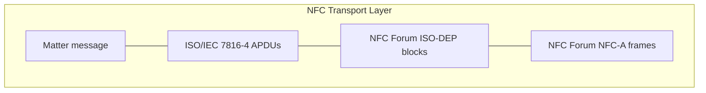
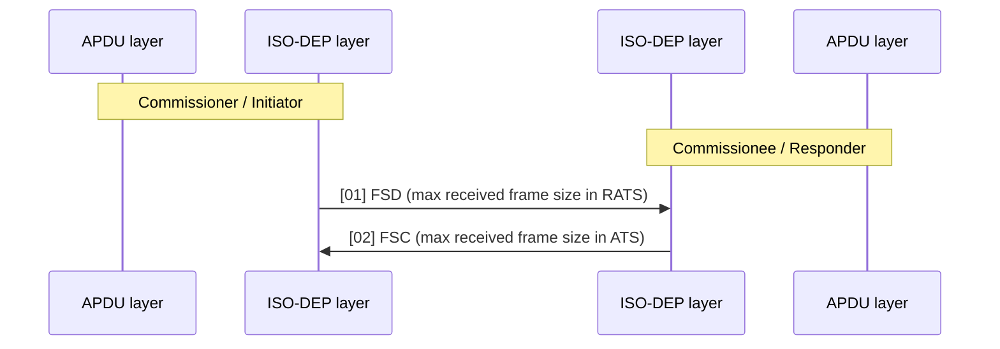
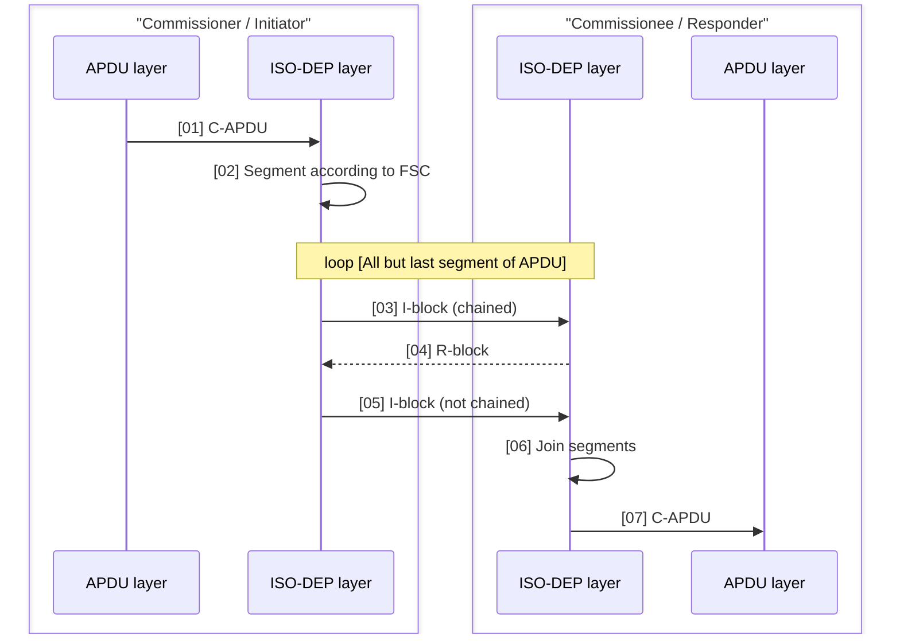
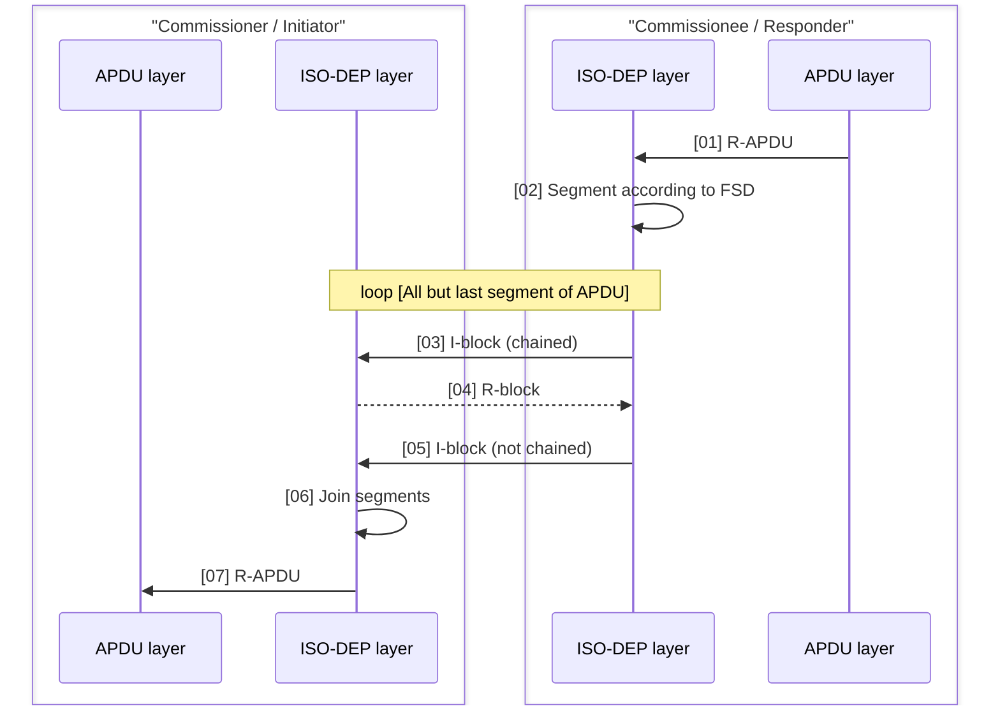
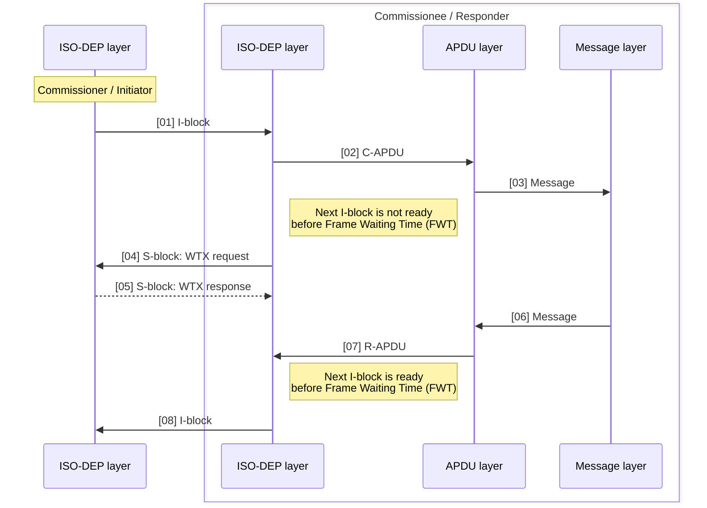
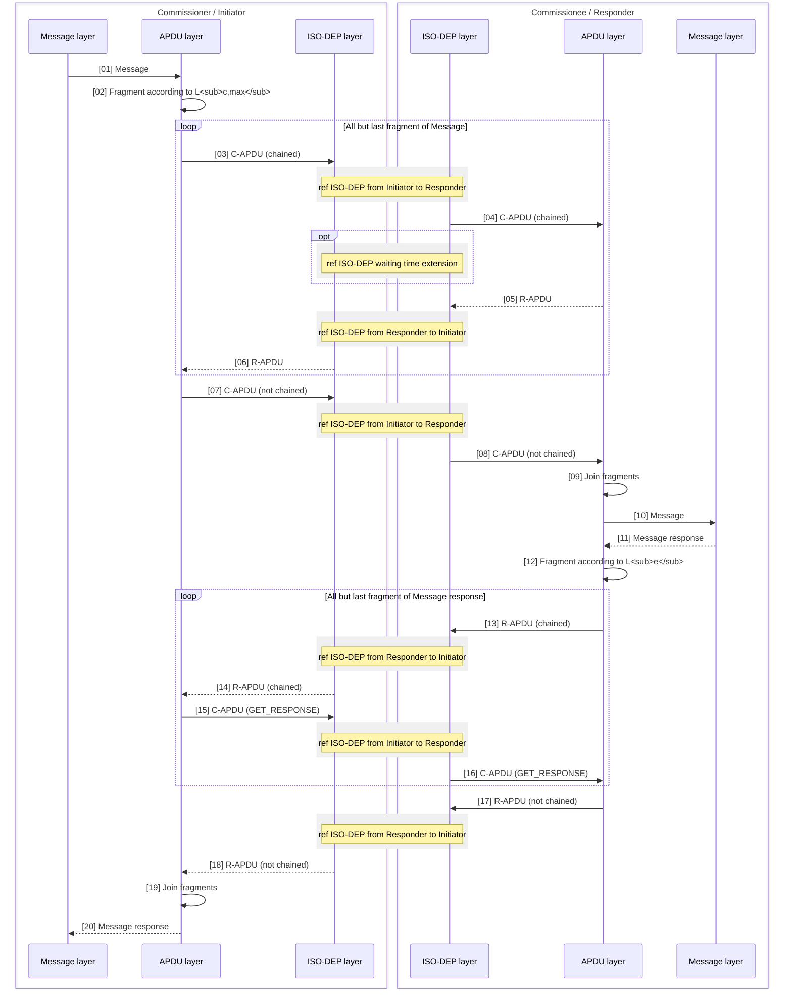

<table>
  <tbody>
    <tr>
        <td>Constant Name</td>
        <td>Description</td>
        <td>Default</td>
    </tr>
    <tr>
        <th>PAFTP_ACK_TIMEOUT</th>
        <th>The maximum amount of time after receipt of a segment before a stand-alone ACK must be sent.</th>
        <th>15 seconds</th>
    </tr>
    <tr>
        <th>PAFTP_CONN_IDLE_TIMEOUT</th>
        <th>The maximum amount of time no unique data has been sent over a PAFTP session before the Commissioner must close the PAFTP session.</th>
        <th>30 seconds</th>
    </tr>
  </tbody>
</table>

## 4.21. NFC Transport Layer (NTL)

The NFC Transport Layer (NTL) defines how to transfer Matter commissioning messages over an NFC interface.

> **NOTE**
> NTL is only used when performing device commissioning over an NFC interface (referred as NFC-based Commissioning). NTL is not used for the reading of the Onboarding Payload from an NFC Tag.

> **NOTE**
> Support for NFC Transport Layer and all features that requires its use is provisional.

Messages are embedded into Application Programming Data Units (APDU) in compliance with ISO/IEC 7816-4. These APDUs are transferred in blocks according to the ISO-DEP protocol as defined in NFC Forum Digital Specification. Each block is transmitted wirelessly using NFC-A technology as defined in NFC Forum Digital Specification.

The layering inside NTL is shown in NFC Transport Layer stack, and described in following sections.

*Figure 36. NFC Transport Layer stack*

NTL provides a reliable, datagram-oriented, transport interface with asymmetric roles: one end always transmits first, and the other end always responds. When NTL is used for Matter commissioning, the Commissioner always transmits first and the Commissionee responds.

### 4.21.1. NFC Forum requirements

Because NTL relies on correct implementation of NFC Forum specification:

* products implementing NTL as a Commissioner SHALL comply with the NFC Forum requirements for an NFC Forum Reader/Writer Module supporting Type 4A Tag Operation,
* products implementing NTL as a Commissionee SHALL comply with the NFC Forum requirements for either NFC Forum Type 4A Tag Module or NFC Forum Type 4A Tag Platform Module (Card Emulation).

> **NOTE**
> Corresponding NFC Forum Devices eligible to receive the NFC Forum Certification Mark are defined in NFC Forum Devices Requirements.

### 4.21.2. NFC-A technology

Commissioners supporting NTL SHALL act as an NFC Forum Type 4A Tag Platform in Poll Mode as defined in NFC Forum Digital Specification.

Commissionees supporting NTL SHALL act as an NFC Forum Type 4A Tag Platform in Listen Mode as defined in NFC Forum Digital Specification.

### 4.21.3. ISO-DEP

ISO-DEP is a half-duplex block transmission protocol providing retransmission and chaining features.

The full ISO-DEP protocol SHALL be implemented in compliance with NFC Forum Digital Specification.

This section highlights some features of the ISO-DEP protocol in the context of Matter communication for information.

During NFC protocol activation, the NFC Reader Device sends a RATS frame in which the maximum frame size it can receive (FSD) is coded, and the NFC Tag Device sends an ATS frame in which the maximum frame size it can received (FSC) is coded.

Figure 37. ISO-DEP protocol activation

This information is used by the ISO-DEP layer to segment the APDU to transmit, utilizing the ISO-DEP chaining feature. On the receiver side, the ISO-DEP layer takes care of re-assembling the chained segments.

Figure 38. ISO-DEP chaining from initiator to responder

Figure 39. ISO-DEP chaining from responder to initiator

A default maximum response timing is announced by the responder in the RATS frame, but when the responder requires more time to respond, it can extend the initiator waiting time by sending appropriate S-block as shown in ISO-DEP Waiting time extension

Figure 40. ISO-DEP Waiting time extension

The ISO-DEP protocol also features retransmission when a frame is not received or incorrectly received, making it a reliable transport protocol.

### 4.21.4. APDU layer

The APDU layer encapsulates Matter messages into APDUs conforming to ISO/IEC 7816-4. It provides a datagram-oriented transport interface tunneled over encapsulation in a series of command requests and their associated responses.

For this purpose, the following commands are used:

Table 43. APDU commands used in NTL

<table>
  <tbody>
    <tr>
        <td>Class</td>
        <td>Commands</td>
    </tr>
    <tr>
        <th>Interindustry</th>
        <th>SELECT, GET RESPONSE</th>
    </tr>
    <tr>
        <th>Proprietary</th>
        <th>TRANSPORT</th>
    </tr>
  </tbody>
</table>

The commands (C-APDU) are always issued by the NFC Reader/Writer which is the Matter commissioner, and the responses (R-APDU) are always issued by the NFC Listener which is the Matter commissionee.

R-APDU always embeds a status code, and optionally a response payload.

Some smartphone NFC Reader/Writer implementations are limited to a maximum 256-byte APDU payload, which is insufficient to transfer Matter messages required for commissioning. To guarantee interoperability with all NFC Readers/Writers while limiting the number of cases to support, both the NFC Reader/Writer and NFC listener SHALL always use short field coding (aka short length field) of APDUs.

Both commissionee and commissioner SHALL support C-APDU and R-APDU chaining specified in ISO/IEC 7816-4.

In case the size of the Matter message to transmit in the `TRANSPORT` command APDU is bigger than the maximum size that can be transmitted by this APDU, the APDU chaining procedure specified in ISO/IEC 7816-4 SHALL be used, even though the `TRANSPORT` command belongs to proprietary class. Thanks to the APDU chaining procedure, the protocol can handle Matter messages up to 65535 bytes. However, the maximum size of Matter Message than can be actually transferred is limited by memory constraints of the implementation and Message Size Requirements.

### 4.21.4.1. SELECT command

Matter commissioning SHALL be initiated by the NFC Reader/Writer by issuing the 7816-4 SELECT command with the Application Identifier (AID) 'A0 00 00 09 09 8A 77 E4 01' as shown in Table 44.

Table 44. NTL SELECT command APDU

<table>
  <thead>
    <tr>
        <th>CLA</th>
        <th>INS</th>
        <th>P1</th>
        <th>P2</th>
        <th>Lc</th>
        <th>Data (hexadecimal bytes)</th>
        <th>Le</th>
    </tr>
  </thead>
  <tbody>
    <tr>
        <td>0x00</td>
        <td>0xA4</td>
        <td>0x04</td>
        <td>0x0C</td>
        <td>0x09</td>
        <td>A0:00:00:09:09:8A:77:E4:01</td>
        <td>0x00</td>
    </tr>
  </tbody>
</table>

When in commissioning mode, a commissionee SHALL answer to a correct SELECT command with a successful response APDU as shown in Table 45.

Table 45. NTL SELECT Successful response APDU

<table>
  <thead>
    <tr>
        <th>Data</th>
        <th colspan="7"></th>
        <th>SW1</th>
        <th>SW2</th>
    </tr>
  </thead>
  <tbody>
    <tr>
        <td>Version (8 bits)</td>
        <td>0x00 (8 bits)</td>
        <td>0x0 (4 bits)</td>
        <td>Discriminator (12 bits)</td>
        <td>Vendor ID (16 bits)</td>
        <td>Product ID (16 bits)</td>
        <td>Extended Data (0 or more bits)</td>
        <td>0x90</td>
        <td>0x00</td>
        <td></td>
    </tr>
  </tbody>
</table>

Data fields:

*   `Version` is a uint8 that SHALL encode the NTL protocol version supported by the commissionee. The version SHALL be 0x01. Other values SHALL be reserved for future use. The commissioner SHALL use the corresponding NTL protocol to communicate with the commissionee.
*   The next 8 bits, cleared, are undefined (reserved).
*   The next 4 bits, cleared, encode the format of the following fields.
*   The remaining fields are described in Section 5.4.2.4, “Discovery Information”.
    - Devices MAY choose not to advertise either the Vendor ID and Product ID, or only the Product ID due to privacy or other considerations. When choosing not to advertise both Vendor ID and Product ID, the device SHALL set both Vendor ID and Product ID fields to 0. When choosing not to advertise only the Product ID, the device SHALL set the Product ID field to 0. A device SHALL NOT set the Vendor ID to 0 when providing a non-zero Product ID.
    - Extended Data MAY be omitted.

When not in commissioning mode, a commissionee SHALL either ignore the command (no response) or answer with an error response APDU as shown in Table 46 indicating that conditions of use are not satisfied.

Table 46. NTL SELECT Error response APDU

<table>
  <tbody>
    <tr>
        <td>Data</td>
        <td>SW1</td>
        <td>SW2</td>
    </tr>
    <tr>
        <th>Version</th>
        <th>0x69</th>
        <th>0x85</th>
    </tr>
  </tbody>
</table>

In other error cases, a commissionee MAY answer with another error response as described in ISO/IEC 7816-4.

### 4.21.4.2. TRANSPORT command

Once commissioning has been successfully initiated with the SELECT command, Matter messages SHALL be exchanged using the proprietary TRANSPORT command. This command is defined by instruction (INS) code 0x20 with parameters P1 and P2 encoding the length of the message to transmit.

*Table 47. TRANSPORT Command APDU*

<table>
  <tbody>
    <tr>
        <td>CLA</td>
        <td>INS</td>
        <td>P1</td>
        <td>P2</td>
        <td>Lc</td>
        <td>Data</td>
        <td>Le</td>
    </tr>
    <tr>
        <th>0x80 (unchained) 0x90 (chained)</th>
        <th>0x20</th>
        <th>...</th>
        <th>...</th>
        <th>...</th>
        <th>...</th>
        <th>...</th>
    </tr>
  </tbody>
</table>

*   The `Lc` single-octet field SHALL encode the length in octets of the payload’s Data field in compliance with ISO/IEC 7816-4. To optimize underlying ISO-DEP chaining, `Lc` SHOULD be less or equal than `min(255,FSC-10)`.
*   `P1` and `P2` SHALL encode the number of octets of the full message to transmit. It is encoded as a 2-bytes integer with `P1` being the most significant byte. In case the full message fits in a single command, the value is equal to `Lc`. In case the message requires chaining, the value is bigger than `Lc`. The same value SHALL be used in all chained commands.
*   The `Data` field SHALL contain a fragment of the message to transmit, possibly the only one.
*   The `Le` single-octet field SHALL encode the maximum length in octets that the reader/writer can receive in the response APDU in compliance with ISO/IEC 7816-4. To optimize underlying ISO-DEP chaining, `Le` SHOULD encode the value equal to `min(256,FSD-6)`.

The response APDU allows the responder to transmit a message to the initiator. In case the full message fits within the number of bytes encoded by `Le` in C-APDU, a successful response SHALL be indicated by the `SW1` and `SW2` values in Table 48.

*Table 48. TRANSPORT successful Response APDU - Complete*

<table>
  <tbody>
    <tr>
        <td>Data</td>
        <td>SW1</td>
        <td>SW2</td>
    </tr>
    <tr>
        <th>Message or last fragment of message to transmit</th>
        <th>0x90</th>
        <th>0x00</th>
    </tr>
  </tbody>
</table>

In case the full message does not fit within the number of bytes encoded by `Le` in C-APDU, a successful but incomplete response SHALL be indicated by the `SW1` value in Table 49, and `SW2` SHALL encode the number of bytes of message to be sent in the next `GET RESPONSE` R-APDU.

*Table 49. TRANSPORT successful Response APDU - Incomplete message*

<table>
  <tbody>
    <tr>
        <td>Data</td>
        <td>SW1</td>
        <td>SW2</td>
    </tr>
    <tr>
        <th>Fragment of message to transmit</th>
        <th>0x61</th>
        <th>...</th>
    </tr>
  </tbody>
</table>

In case the chained message exceeds the maximum supported message size, an error response conforming to Table 50 SHALL be issued, indicating 'Not enough memory space'.

Table 50. TRANSPORT error Response APDU - Not enough memory space

<table>
  <tbody>
    <tr>
        <td>SW1</td>
        <td>SW2</td>
    </tr>
    <tr>
        <td>0x6A</td>
        <td>0x84</td>
    </tr>
  </tbody>
</table>

### 4.21.4.3. GET RESPONSE command

This command SHALL be issued following the reception of an incomplete successful R-APDU, in compliance with ISO/IEC 7816-4.

Table 51. GET RESPONSE command APDU

<table>
  <tbody>
    <tr>
        <td>CLA</td>
        <td>INS</td>
        <td>P1</td>
        <td>P2</td>
        <td>Le</td>
    </tr>
    <tr>
        <td>0x00</td>
        <td>0xC0</td>
        <td>0x00</td>
        <td>0x00</td>
        <td>...</td>
    </tr>
  </tbody>
</table>

*   The Le single-octet field SHALL encode the maximum length in octets that the reader/writer can receive in the response APDU in compliance with ISO/IEC 7816-4. To optimize underlying ISO-DEP chaining, Le SHOULD encode the value equal to $min(256, FSD-6)$.

Successful response APDU is in following tables:

Table 52. GET RESPONSE successful Response APDU - Complete message

<table>
  <tbody>
    <tr>
        <td>Data</td>
        <td>SW1</td>
        <td>SW2</td>
    </tr>
    <tr>
        <td>Message or last fragment of message to transmit</td>
        <td>0x90</td>
        <td>0x00</td>
    </tr>
  </tbody>
</table>

Table 53. GET RESPONSE successful Response APDU - Incomplete message

<table>
  <tbody>
    <tr>
        <td>Data</td>
        <td>SW1</td>
        <td>SW2</td>
    </tr>
    <tr>
        <td>Fragment of message to transmit</td>
        <td>0x61</td>
        <td>...</td>
    </tr>
  </tbody>
</table>

In case GET RESPONSE is received, but not following a TRANSPORT successful Response APDU - Incomplete message, the commissionee SHALL answer with an error indicating the condition of use is not satisfied, as shown in Table 54

Table 54. GET RESPONSE error Response APDU - Condition of use not satisfied

<table>
  <tbody>
    <tr>
        <td>SW1</td>
        <td>SW2</td>
    </tr>
    <tr>
        <td>0x69</td>
        <td>0x85</td>
    </tr>
  </tbody>
</table>

### 4.21.4.4. APDU sequence diagram

A sequence diagram showing the APDU chaining feature is shown in NTL APDU sequence diagram.

Figure 41. NTL APDU sequence diagram

# 4.22. Check-In Protocol

The goal of the Check-In Protocol is to provide a way for a server to notify a client of an event or state outside of a secure session in a private and secure fashion.

Some of the events or states to be shared with a client are defined by different Check-in Protocol Use Cases. The current list includes:

*   An ICD is available for communication.

The Check-In Protocol is a set of requirements and processes that can be re-used by multiple Check-In Protocol use cases. Multiple Check-In Protocol use cases can coexist on a single device. The