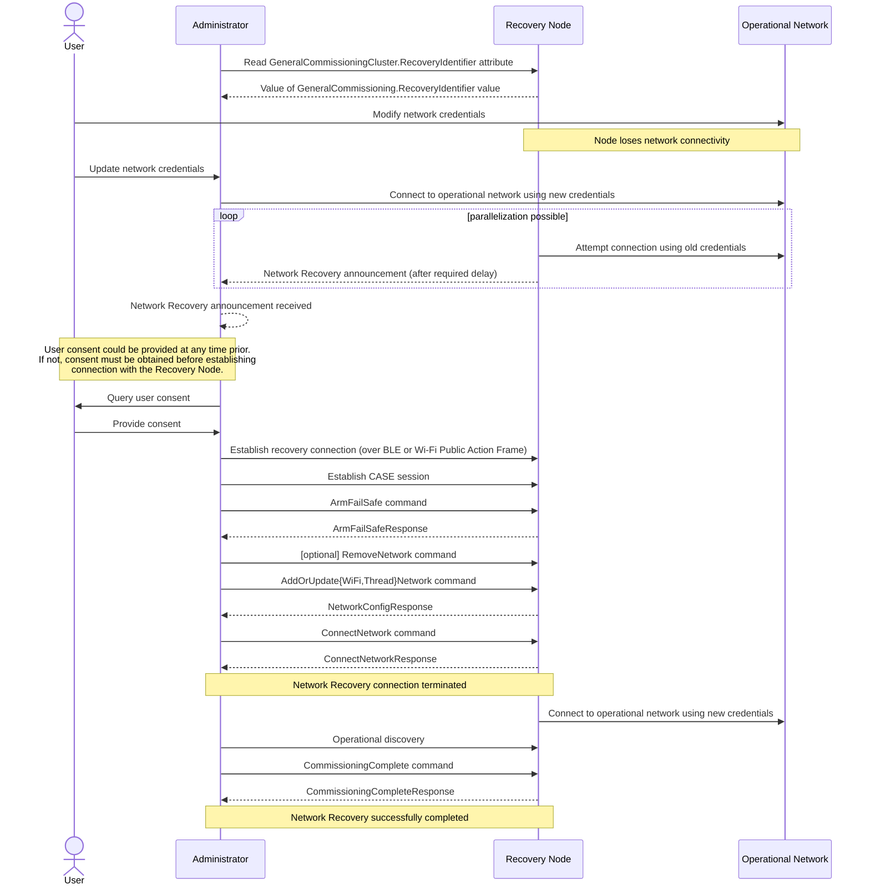

# 5.8. In-field Upgrade to Matter

This (informative) section discusses the case of a pre-Matter device currently in the user’s home which gets software updated to support Matter, and which steps (either Matter-specified or manufacturer specific) would typically be applied to accomplish this goal.

*   The initial situation is a device which is connected to the local network, and some manufacturer specific means (e.g. a manufacturer-provided app) is used to provide new firmware (including Matter functionality) to the device, along with the associated Certification Declaration. Also, a unique Device Attestation Certificate is provided into the device using secure, manufacturer-specific means.
*   The device restarts to enable the new firmware, and is now an uncommissioned Matter device.
*   The device can be commissioned by any Commissioner; the Onboarding Payload needs to be provided to that Commissioner (since this information is not provided on or with the device out of the factory).
    *   For this, similar mechanisms as discussed as in Section 5.6.3, “Enhanced Commissioning Method (ECM)” can be employed:
        *   information equivalent to the parameters of the OpenCommissioningWindow command is sent to the device using some secure manufacturer-defined means
        *   presentation of the Onboarding Payload and other relevant information can be performed using the mechanisms described in Section 5.6.3.1, “Presentation of Onboarding Payload for ECM”.
    *   For devices with a means to output the Onboarding Payload themselves (e.g. device with a display or audio output), alternatively, similar mechanisms as discussed as in Section 5.6.2, “Basic Commissioning Method (BCM)” can be employed:
        *   information equivalent to the parameters of the OpenBasicCommissioningWindow command is sent to the device using some secure manufacturer-defined means
        *   the device itself presents Onboarding Payload.

# 5.9. Network Recovery

The operational network credentials (e.g., network name, password) can be changed after a node has been commissioned (see Section 5.5, “Commissioning Flows”). If this occurs, a Node might no longer be able to access its operational network. In that situation, the Node and an Administrator can execute a sequence of steps, called Network Recovery, to allow the Node to attempt to re-establish network connectivity.

Support for Network Recovery is optional and is indicated via the Network Recovery feature bit being set in the FeatureMap attribute of the General Commissioning Cluster.

> **NOTE** Support for Network Recovery flows is provisional.

### 5.9.1. Network Recovery channels

Conceptually, the Network Recovery process is possible over any commissioning channel. As the Matter specification evolves, the designers SHOULD consider providing a Network Recovery feature for any new commissioning channel. In order to fully specify the Network Recovery procedure, commissioning channel definitions SHALL specify:

*   an advertising format that distinguishes a network recovery advertisement from the commissioning advertisement. The advertisement for Network Recovery SHALL contain the value of the RecoveryIdentifier attribute and SHOULD contain the error codes that led to the need for network recovery.
*   provisions for Extended Announcement of Network Recovery advertisements.
*   an ability to establish a CASE session over the commissioning channel. That CASE session SHALL be used for the recovery of network connectivity and not for steady state operational interaction.

### 5.9.2. Implementer Considerations

When the network connectivity is lost — for example, resulting from equipment replacement, network reconfiguration, etc. — it is usually desirable to restore connectivity to all affected devices. In some cases, the loss of network connectivity is intentional with the user expecting not to reconnect some of the end devices or some of the controllers to the network. It MAY be impossible for an Administrator to discern the user’s intent that led to the loss of connectivity, so Administrators SHALL seek user consent / intent to determine which Nodes would be subject to the Network Recovery process.

### 5.9.3. Network Recovery Flow

The Network Recovery process consists of the following steps enumerated below. Recovery Node refers specifically to the node that has lost its operational network connectivity. This process assumes that the operational network credentials for one or more Nodes has been changed such that those Nodes are no longer able to communicate with other Nodes, including Administrators. Normative requirements below apply to Nodes that choose to implement the Network Recovery feature.

1.  At some time before the operational network credentials change, an Administrator SHOULD retrieve the value of the RecoveryIdentifier attribute from the GeneralCommissioning cluster on the Recovery Node. This MAY be done during the commissioning process.
2.  The Administrator SHALL have the new credentials required to connect to the operational network, and the new operational network SHALL be present and operational.
3.  Should operational network connectivity be lost, the Recovery Node SHALL continue to attempt to connect to the operational network for a duration of at least 120 seconds using its existing credentials. Afterwards it MAY choose to enter Network Recovery mode and commence announcement. Recovery Nodes SHALL attempt to reconnect to the existing operational network while in the recovery state. Given that temporary network outages occur with some frequency, waiting before entering Network Recovery mode and commencing announcement limits wireless spectrum pollution/interference and helps to limit attack opportunities.

4. The Recovery Node SHALL perform recovery announcement using any of its available commissioning channels. A Recovery Node utilizing its BLE interface SHALL advertise the Network Recovery payload (see BLE Service Data payload format). A Recovery Node utilizing its Wi-Fi interface with Wi-Fi Unsynchronized Service Discovery SHALL publish its Recovery ID using Wi-Fi Unsynchronized Service Discovery (see Table 74, “Publish method arguments values for discovery”). The Administrator uses the Node’s advertised OpCode (see BLE Device Opcode and Wi-Fi Public Action Frame Device Opcode) to identify Recovery Nodes in the Network Recovery mode. Recovery Node announcements SHALL follow the announcement duration requirements described in Announcement Duration and SHALL take advantage of the Extended Announcement duration.

5. If the Extended Announcement duration ends and the Recovery Node is still unable to reach its operational network, it SHALL continue to attempt to reconnect to the existing operational network at a manufacturer-defined interval. The Recovery Node SHALL restart the Network Recovery procedure when the steps enumerated in CommissioningModeInitialStepsHint are performed.

6. The Administrator SHALL obtain user consent before providing new credentials to a Recovery Node. This step need not occur in the order it appears in this list of steps (*i.e.*, it could have been obtained earlier). User consent helps ensure that credentials are not inadvertently provided to imposter devices, erroneously provided during a temporary network outage, etc.

7. If user consent has not been granted, the Administrator terminates its execution of the Network Recovery flow and the following steps SHALL NOT be performed.

8. The Administrator establishes a connection with the Recovery Node over BLE or Wi-Fi as it would to commission an uncommissioned device.

9. Once connected, the Administrator and Recovery Node SHALL establish a secure session using CASE for purposes of provisioning the Recovery Node with updated network credentials. All messages exchanged over the recovery connection SHALL be encrypted using CASE-derived keys. Network recovery procedure SHALL preempt autonomous network reconnect attempts: once the secure connection is established, any ongoing attempts taken autonomously by the Recovery Node to re-establish connectivity to the previously configured operational network SHALL be suspended and SHALL NOT interfere with the session established in this step. Autonomous attempts to re-establish network connectivity SHALL resume in the event of failure of the network recovery procedure. The remainder of the steps is substantially the same as the network commissioning during a commissioning flow, except that they are transacted over a CASE session instead of a PASE session. In addition to the remaining network recovery steps, Recovery Nodes SHALL allow any and all transactions allowed over a CASE session, such as reading Basic Information cluster or accessing device configuration data and topology, as Administrators might require them to fully restore network connectivity.

10. Upon successful establishment of the CASE session, the Recovery Node SHALL autonomously arm the fail-safe timer for a timeout of 60 seconds. This is to guard against the Administrator not proceeding with the rest of the flow in a timely fashion, and is analogous to step 6 of the standard commissioning flow.

11. Within 60 seconds of establishing the CASE session, the Administrator SHALL arm the fail-safe timer. If the fail-safe could not be successfully armed, the Administrator SHALL terminate the session.

12. The Administrator MAY choose to delete a Recovery Node’s existing network credentials by

sending a `RemoveNetwork`. The Administrator SHALL provide the new credentials of the operational network to the Recovery Node using the `AddOrUpdateWiFiNetwork` or `AddOrUpdateThreadNetwork` commands.

13. The Administrator SHALL then instruct the Recovery Node to connect to the operational network using the new credentials by issuing a `ConnectNetwork` command.

14. The Recovery Node SHALL attempt to connect to the operational network using the newly-provisioned credentials. Once connected, all messages associated with the remaining Network Recovery steps between the Administrator and Recovery Node SHALL be exchanged over the operational network. These messages SHALL be communicated over a CASE session.

15. The Administrator and the Recovery Node SHALL discover each other on the operational network using operational discovery (see Section 4.3.2, “Operational Discovery”).

16. The Administrator and the Recovery Node SHALL indicate successful completion of the Network Recovery flow using the `CommissioningComplete` and `CommissioningCompleteResponse` commands. These commands SHALL be sent over a CASE session over the operational network. The Recovery Node SHALL reject the `CommissioningComplete` that is not received over the operational network.

Figure 51. Network Recovery sequence diagram